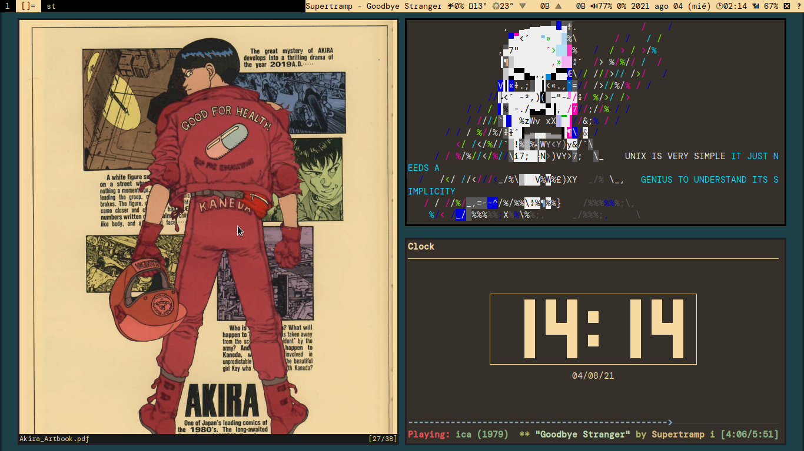

# *

# MATERIAL ESTUDIO

Para acceder a los apuntes personales, ir:

* [Apuntes Civil](https://github.com/lucascfernandez/dots/blob/main/civil.html)
* [Apuntes Procesal](https://github.com/lucascfernandez/dots/blob/main/procesal.html)
* [Apuntes Humanos](https://github.com/lucascfernandez/dots/blob/main/humanos.html)
* [Glosario de Conceptos](https://github.com/lucascfernandez/dots/blob/main/conceptos.html)

*Estos materiales están en constante modificación y no representan un trabajo concluido.*

## ABREVIATURAS

Se recomienda tener presente las siguientes abreviaturas, las cuales son utilizadas en los apuntes señalados arriba.

+ **COS**   = *citación a oír sentencia*
+ **df.**   = *definición*
+ **excp.** = *excepción*
+ **i.**   = *instrumento*
+ **MPR**   = *medidas para mejor resolver*
+ **OCDE**  = *Organización para la Cooperación y el Desarrollo Económico*
+ **p. ej.**= *por ejemplo*
+ **rg.**   = *regla general*
+ **re.**   = *regla especial*
+ **ss.**   = *siguiente*

# *	*

# DOTFILES

## Presentación

Archivos básicos de configuración personal. Simplemente, se trata del esquema de colores de [Fmash16](https://github.com/fmash16/dotfiles) en [LARBS](https://larbs.xyz/) de [Luke Smith](https://lukesmith.xyz/).

Tienen un carácter personal, pero cualquiera puede utilizarlo.

Saludos!

## Paquetes adicionales que requieren instalación:

* Fuentes: Nerd Fonts, DM mono.
* xflux.
