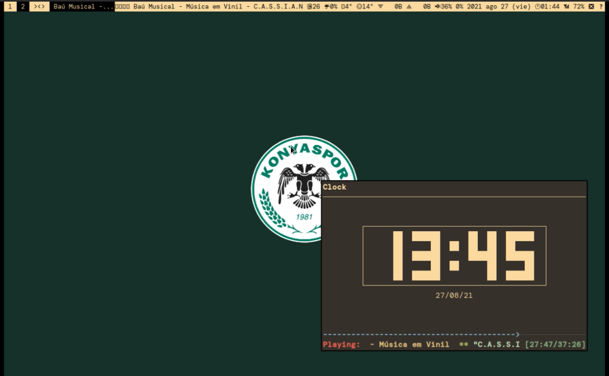

# *	*	*

# PRESENTACIÓN

## MEP: Material de Estudio Permanente

*Partiendo del supuesto que el conocimiento solamente tiene valor cuando es compartido y difundido permanentemente, en este lugar podrás acceder a algunos apuntes (personales y aún no completos) sobre las materias de Derecho Civil, Derecho Procesal y Derechos Humanos, además de un glosario con conceptos que he ido reuniendo a lo largo del tiempo. Sin perjuicio de lo anterior, dichos archivos se encuentran en este [repositorio](https://github.com/lucascfernandez/mep), los cuales pueden ser descargados y editados por cualquier persona bastando para eso tener un editor de texto.*

*Vale señalar, que estos archivos están en formato Markdown, debido a su sintaxis extremadamente fácil de manipulación. Además, tal como indica su nombre, tiene la característica de ser "permanente" y será constantemente modificado, ojalá que para mejor.*

*Por último, para contactarse con su autor, remitir correo electrónico a la dirección que está al inicio de la página, siempre será bienvenida cualquier tipo de colaboración o feedback.*

*Saludos!*

## MATERIAL ESTUDIO

Para acceder a los apuntes antes mencionados, ir a:

- [Apuntes Civil](https://github.com/lucascfernandez/mep/blob/main/vimwiki/vimwiki/civil.md)

- [Apuntes Procesal](https://github.com/lucascfernandez/mep/blob/main/vimwiki/vimwiki/procesal.md)

- [Apuntes Humanos](https://github.com/lucascfernandez/mep/blob/main/vimwiki/vimwiki/humanos.md)

Para acceder al glosario con conceptos, ir a:

- [Glosario de Conceptos](https://github.com/lucascfernandez/mep/blob/main/vimwiki/vimwiki/conceptos.md)

*(Se recuerda que estos materiales están en constante modificación, y no representan bajo ningún aspecto un trabajo concluido)*

## ABREVIATURAS

Dado que los apuntes fueron confeccionados privilegiando la rapidez y la síntesis, se recomienda tener presente las siguientes abreviaturas:

+ **COS**   = *citación a oír sentencia*
+ **df.**   = *definición*
+ **excp.** = *excepción*
+ **i.**    = *instrumento*
+ **MPR**   = *medidas para mejor resolver*
+ **OCDE**  = *Organización para la Cooperación y el Desarrollo Económico*
+ **p. ej.**= *por ejemplo*
+ **rg.**   = *regla general*
+ **re.**   = *regla especial*
+ **ss.**   = *siguiente*

## MATERIALES DE SOPORTE

### Carpetas con Materiales

Con el fin de que el contenido de los apuntes tengan relación con las materias de fondo, se pone a disposición del visitante los siguientes materiales:

- [Carpeta Derechos Humanos](https://drive.google.com/drive/folders/1uEzCTRiRCATBn_9uME-51CLfqgjXGHXf?usp=sharing)

- [Carpeta con Esquemas](https://drive.google.com/drive/folders/1LKwkIFfM3sOfk-ea_Xww4Hpz6z_gED4m?usp=sharing)

### Tarjetas de Memoria

El autor también pone a disposición del visitante sus mazos con tarjetas de memorias de la aplicación [Anki](https://ankiweb.net) la cual es gratuita, simple y funcional.

Para acceder a ella basta con utilizarla desde su pagina web, pero recomiendo descargarla, tanto en su versión para [PC](https://apps.ankiweb.net), como para [android](https://play.google.com/store/apps/details?id=com.ichi2.anki&hl=es_CL&gl=US) (si tienes problema para descargar desde la pagina web, simplemente busque "Ankidroid" en la Google Store), como también para IOS (para lo cual recomiendo utilizar el navegador Safari mismo).

Al tener la aplicación instalada puedes *importar* los mazos que dejaré a continuación:

- [Mazos](https://drive.google.com/drive/folders/1OD57fxwtrhcLhKemoXV4dnnXPaqMMtRK?usp=sharing)

Dentro de la carpeta debes descargar el archivo, presionando el botón derecho, que comienza con el nombre "colección-[...]".

Si necesitas ayuda con importar los mazos vea el siguiente vídeo:

- [Tutorial "Importar Mazos PC"](https://drive.google.com/file/d/198zBvDzHc1i9V1j3z5ZFZY0DK9MYLO5p/view?usp=sharing)

### Audio

Teniendo presente una mejor instancia de análisis, y de concentración al momento de realizar las respectivas lecturas, se recomienda hacerlo escuchando alguna pista de audio acorde, tal como las contenidas en la siguiente carpeta:

- [Carpeta de Audios](https://drive.google.com/drive/folders/1I50MrC5LsfSD77XpfU3vgcf2zxVlDjzS?usp=sharing)

# DOTFILES

Por otro lado, si el visitantes es usuario o le llama la atención el sistema operativo GNU/Linux, el autor mantiene público sus archivos de configuración, los cuales pueden ser clonados y probados. Por lo que le recomendaría ir a:

- [Repositorio](https://github.com/lucascfernandez/dots)

# *	*	*
