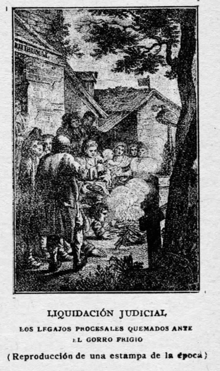

# *	*	*

# PRESENTACIÓN

## MEP = Material de Estudio Permanente

*Partiendo del supuesto que el conocimiento solamente tiene valor cuando es compartido y difundido permanentemente, en este lugar podrás acceder a algunos apuntes (personales y aún no completos) sobre las materias de Derecho Civil, Derecho Procesal y Derechos Humanos, además de un glosario con conceptos que he ido reuniendo a lo largo del tiempo. Sin perjuicio de lo anterior, dichos archivos se encuentran en este [repositorio](https://github.com/lucascfernandez/mep), los cuales pueden ser descargados y editados por cualquier persona bastando para eso tener un editor de texto.*

*Vale señalar, que estos archivos están en formato Markdown, debido a su sintaxis extremadamente fácil de manipulación. Además, tal como indica su nombre, tiene la característica de ser "permanente" y será constantemente modificado, ojalá que para mejor.*

*Por último, para contactarse para su autor, remitir correo electrónico a la dirección que está al inicio de la página, siempre será bienvenida cualquier tipo de colaboración o feedback.*

*Saludos!*

# MATERIAL ESTUDIO

Para acceder a los apuntes antes mencionados, ir a:

*[Apuntes Civil](https://github.com/lucascfernandez/mep/blob/main/vimwiki/vimwiki/civil.md)

*[Apuntes Procesal](https://github.com/lucascfernandez/mep/blob/main/vimwiki/vimwiki/procesal.md)

*[Apuntes Humanos](https://github.com/lucascfernandez/mep/blob/main/vimwiki/vimwiki/humanos.md)

Para acceder al glosario con conceptos, ir a:

* [Glosario de Conceptos](https://github.com/lucascfernandez/mep/blob/main/vimwiki/vimwiki/conceptos.md)

*(Se recuerda que estos materiales están en constante modificación y no representan, bajo ningún aspecto, un trabajo concluido)*

## MATERIALES DE SOPORTE

Con el fin de que el contenido de los apuntes sean relación con las materias de fondo, se pone a disposición del visitante los siguientes materiales:

*[Carpeta Soporte Derechos Humanos](https://drive.google.com/drive/folders/1uEzCTRiRCATBn_9uME-51CLfqgjXGHXf?usp=sharing)

*[Carpeta con Esquemas](https://drive.google.com/drive/folders/1LKwkIFfM3sOfk-ea_Xww4Hpz6z_gED4m?usp=sharing)

Teniendo presente una mejor instancia de análisis, y de concentración al momento de realizar las respectivas lecturas, se recomienda hacerlo escuchando alguna pista de audio acorde, tal como las contenidas en la siguiente carpeta:

*[Carpeta de Audios](https://drive.google.com/drive/folders/1I50MrC5LsfSD77XpfU3vgcf2zxVlDjzS?usp=sharing)

# ABREVIATURAS

Dado que los apuntes fueron confeccionados privilegiando la rapidez y la síntesis, se recomienda tener presente las siguientes abreviaturas:

+ **COS**   = *citación a oír sentencia*
+ **df.**   = *definición*
+ **excp.** = *excepción*
+ **i.**   = *instrumento*
+ **MPR**   = *medidas para mejor resolver*
+ **OCDE**  = *Organización para la Cooperación y el Desarrollo Económico*
+ **p. ej.**= *por ejemplo*
+ **rg.**   = *regla general*
+ **re.**   = *regla especial*
+ **ss.**   = *siguiente*
