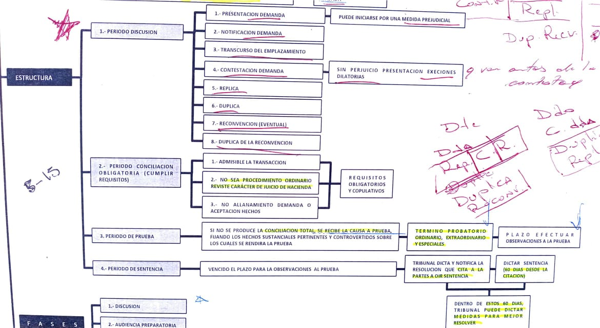

# Derecho Procesal

# 1. Derecho Procesal

- concepto

    aquella rama del derecho que estudia la organización de los TRB, señala sus
    atribuciones y competencias y determina las normas de procedimiento a que
    deben someterse tanto los TRB como las personas que concurren ante ellos
    planteando pretensiones procesales.

- contenido
    - orgánico

	es aquella rama del derecho procesal que comprende el estudio de la
	organización de los TRB de justicia y de sus atribuciones y competencia

    - funcional

	es aquella rama del derecho procesal que estudia las normas de
	procedimiento a que deben someterse tanto los TRB como las personas que
	concurren ante ellos planteando pretensiones procesales.

- características
    1. derecho público
    2. formal (forma, modo de realizar la actividad)
    3. autónomo y no adjetivo (tiene sus propios ppios, normas, instituciones)
    4. normas instrumentales (es el medio para lograr el restablecimiento o
       creación de un orden jurídico vulnerado) jurisdicción = realización
       práctica de las normas substantivas.
- fuentes
    1. directas = CPR, ley procesal, AA, TI
    2. indirectas = dº histórico, dº extranjero, jurisprudencia, doctrina,
       usos, costumbre y equidad.

- Vigencia

	- en cuanto al tiempo

		- Dictada una ley procesal ella rige de inmediato para todos los juicios que van a iniciarse y también para los que ya están en tramitación. Conforme a la jurisprudencia, la ley procesal rige inmediatamente (in actum).
		- Nunca una ley procesal puede afectar un juicio ya terminado y en el cual se ha dictado sentencia que se encuentre firme o ejecutoriada.
		- Los plazos que hubieren empezado a correr y las actuaciones y diligencias que ya estuvieren iniciadas se rigen se rigen por la ley vigente al tiempo de su iniciación
		- los actos o contratos válidamente celebrados bajo el imperio de una ley pueden probarse bajo el imperio de otra con los medios que aquéllas establecen para su justificación, pero la forma de rendirla está subordinada a la ley vigente en el tiempo que se rinda

	- en cuanto al espacio

		- art. 14 CC ppio de territorialidad, que se refleja en el aforismo *lex locus regit actum* que rigen las siguientes normas:
			- organización y atribuciones de los TRB de justicia
			- competencia de los TRB
			- normas relativas a los procedimientos contenciosos o no
			- respecto a los medios de prueba
			- respecto a la ejecución de las resoluciones dictadas por TRB nacionales.

		- excepciones a este ppio:
		  	- normas procesales internacionales, como aquellas sobre la tramitación de exhortos internacionales, cumplimiento de sentencias extranjeras, y sobre la extradición.
			- las señaladas en el art. 6 del COT

			

# 2. Jurisdicción

- concepto

    Couture: es la función pública realizada por órganos competentes del Estado
    con las formas requeridas por la ley en virtud de la cual por acto de
    juicio se determina el derecho de las partes, con el objeto de dirimir sus
    conflicto, controversias de relevancia jurídica mediante decisiones con
    autoridad de cosa juzgada eventualmente factible de ejecución

	Se dice que es factible de ejecución porque en un juicio no sólo interesa obbbtener una declaración favorable, sino que, el vencido cumpla con la prestación a que ha sudo condenado.

- Jurisdicción en la legislación:

    art. 76 CPR "la facultad de conocer de las causas civiles y criminales, de
    resolverlas y de hacer ejecutar lo juzgado, pertenece exclusivamente a los
    TRB establecidos por la ley"

    art. 1 COT "la facultad de conocer la causas civiles y criminales, de
    juzgarlas y de hacer ejecutar lo juzgado pertenece exclusivamente a los TRB
    que establece la ley"

- características
    1. origen constitucional
    2. unidad conceptual
    3. inderogable (por eso es nulo por objeto ilícito el de someterse a jurisdicción extranjera art. 1462)
    4. indelegable
    5. irrenunciable
    6. improrrogable
    7. territorial
    8. produce efecto de cosa juzgada
    9. está amparada por el imperio

- Momentos Jurisdiccionales:
	- *Notio*:

		El TRB toma en conocimiento de las pretensiones de las partes y de sus defensas, además de las pruebas aportadas.
	- *Decisio*:

		TRB resuelve la contienda jurídica lo que se efectúa a través de la sentencia.

		Las sentencias contienen tres partes:

		- *parte expositiva*: se individualiza las partes y se consignan sus alegaciones
		- *parte considerativa*: se efectúa los razonamientos y análisis de las alegaciones y de la prueba rendida
		- *parte resolutiva*: se señala la decisión del asunto controvertido
	- *Executio*:

		Se lleva a efecto el cumplimiento de lo resuelto utilizando, si fuera necesario, la fuerza para ello, denominado imperio.
		Cumplimiento es un concepto amplio que implica llevar a cabo lo dispuesto en la sentencia en la forma que disponga la ley.
		Ejecutar, se refiere a la ejecución forzada.

- equivalentes jurisdiccionales
    - conciliación

	es aquella en que se logra la solución de un conflicto entre las partes
	mediante un acuerdo de ellas, obtenido en un proceso con la
	participación activa del juez.

    - avenimiento

	se diferencia de la conciliación en que éste se obtiene
	extrajudicialmente, sin intervención alguna de un juez el que toma
	conocimiento del mismo a través de una presentación de las partes.

    - transacción

	es un contrato por el cual las partes ponen término extrajudicialmente
	a un litigio pendiente o precaven un litigio eventual, efectuando
	concesiones recíprocas. Para que valga como título ejecutivo se
	requiere que esta esté colocada en una escritura pública.

    - sobreseimiento definitivo

	es aquel en que se pone término al procedimiento penal, liberando al
	imputado de la responsabilidad del hecho atribuido, con autoridad de
	cosa juzgada.

    - sentencia extranjera

	en los casos que la ley le da valor por cuanto reemplaza la sentencia
	que podría haberse dictado en el país a través del procedimiento
	denominado exequátur.

- Lo Contencioso Administrativo

	Son todos aquellos conflictos que surgen entre un particular cualquiera y la Administración del Estado a consecuencia de algún acto administrativo.

# 3. Actos Judiciales no Contenciosos y Atribuciones Conexas

- Actos Judiciales no Contenciosos

	Lo primero que hay que decir, es que no existe una "Jurisdicción No Contenciosa", sino que la ley exige que determinados actos requieren de la intervención de un juez y en los cuales no se promueven conflicto. Es por eso que se dice que se tratan más de una naturaleza administrativa.

- ¿Cuales son las Atribuciones Conexas ?

    Son las que señala el art. 3 del COT en los siguientes términos: "Los TRB
    tienen, además, las facultades *conservadoras, disciplinarias y económicas*
    que a cada uno de ellos se asignan en los en los respectivos títulos de
    este Código"

- Qué es la Facultad Conservadora?

    Consiste en una facultad no jurisdiccional que tiene por objeto mantener
    incólume (sin menoscabo o lesión) el principio constitucional en cuya
    virtud los **órganos estatales no deben rebasar los límites de la actividad
    que la CPR y las leyes le han asignado**.

	- Qué asuntos quedan comprendidos dentro de la Facultad Conservadora?
	    1. El Recurso de Amparo art. 19 Nª 7 y 21 CPR
	    2. El Recurso de Protección art. 20 CPR
	    3. La institución del Privilegio de Pobreza, la cual tiene su fundamento en
	       la garantía señalada en el art. 19 Nª 2 CPR
    	4. Las Visitas que deben realizar los JG a establecimientos penitenciarios,
       en forma semanal o semestral art. 567 y ss. COT
- Qué es la Facultad Disciplinaria?

    Consisten en facultades para mantener la compostura en los debates
    judiciales y en el normal funcionamiento de los órganos que componen el
    Poder Judicial.

- Qué es la Facultad Económica?

    Consiste en medidas de orden general que buscan la correcta administración
    de justicia y se manifiesta a través de los Autos Acordados que dictan los
    TRB superiores que pueden ser de aplicación general reglando situaciones
    específicas.

# 4. Órganos Jurisdiccionales

- Bases de la Administración de Justicia

	- Ppio de Legalidad
		- la organización y atribuciones de los órganos jurisdiccionales debe estar fijado por ley = art. 76 CPR, art. 1 COT
		- los órganos jurisdiccionales deben observar rigurosamente las leyes procesales, ya que la sentencia debe fundarse en un proceso previo legalmente tramitado
	- Ppio de Territorialidad

		art. 7 COT los TRB sólo ejercen su potestad en los negocios y dentro del territorio que la ley les hubiere respectivamente asignado
	- Ppio de Independencia

		art. 12 COT El poder judicial es independiente de toda otra autoridad en el ejercicio de sus funciones.

		art. 7 y 76 CPR, 222 CP, 4 COT.
	- Ppio de Jerarquía

		El sistema de administración de justicia debe ser aplicado por diversos órganos jurisdiccionales ordenados jerárquicamente, en una estructura piramidal, para distribuir la competencia y permitir que los juicios sean fallados a lo menos por dos TRB.
		Se encuentra vinculado con un sistema de recursos de doble instancia.
	- Ppio de Publicidad

		art. 9 COT Los actos de los TRB son públicos, salvo las excepciones expresamente establecidas por la ley
	- Ppio de Pasividad

		art. 10 Los TRB no podrán ejercer su ministerio sino a petición de parte, salvo los casos en que la ley los faculte para proceder de oficio
	- Ppio de Inamovilidad

		art. 80 CPR Privilegio o garantía consagrado en beneficio de los magistrados judiciales. Tiene las ss. excepciones:
			- en caso de delitos
			- mal comportamiento
			- causales de orden constitucional
	- Ppio de la Inexcusabilidad

		art. 10 COT una vez reclamada su intervención en forma legal y en negocios de su competencia, no podrán excusarse de ejercer su autoridad ni aun por falta de ley que resuelva la contienda sometida a su decisión.

		Son excepciones: la incompetencia por causales de implicancia y recusación, o la acumulación.
	- Ppio de Responsabilidad

		art. 79 CPR y 13 COT, los jueces son personalmente responsables por los delitos de cohecho, falta de observancia en materia sustancial de las leyes que reglan el procedimiento, denegación y torcida administración de justicia u toda prevaricación en el desempeño de sus funciones.

- Qué se entiende por Órgano Jurisdiccional?

    Son órganos públicos, que realizan la función de jurisdicción, es decir, la
    de resolver litigios con eficacia de cosa juzgada y eventual posibilidad de
    ejecución, sin perjuicio de los demás actos no jurisdiccionales que la ley
    pueda encomendar a ellos, como seria el caso de las atribuciones conexas y
    los actos judiciales no contenciosos.

- Cómo se clasifican los TRB de acuerdo a su materia art. 5 COT?
    - En TRB ordinarios

	La CS, las CA, el Presidente de la CS, el Presidente de la CA de
	Santiago, un Ministro de CA, los TRB de JO en lo penal, los Jueces de
	Letras y los JG.

    - TRB especiales que forman parte del Poder Judicial
	1. los Juzgados de Familia
	2. los Juzgados de Letras del Trabajo
	3. los Juzgados de Cobranza Laboral y Previsional
	4. los TRB Militares en tiempo de Paz
	- Estos TRB se rigen por cuales normas?

	    Se rigen por sus propias leyes sobre atribuciones y organización
	    ley 19.968, Código del Trabajo, en el Código de Justicia Militar y
	    en sus leyes complementarias. Las normas del COT solo se aplicarán
	    a ellos cuando los cuerpos legales citados se remitan expresamente
	    a él. Así por ejemplo art. 1 de la 19.968 que crean los TRB de
	    familia señala que en lo no previsto en ella se rige por las normas
	    del COT.

    - TRB especiales que no forman parte del Poder Judicial
	1. Juzgado de Policía Local
	2. TC
	3. Contraloría General de la República
	4. El Senado
	5. Director del SII
	- Estos TRB se rigen por cuales normas?

	    Se rigen por sus propias leyes especiales, sin perjuicio de quedar
	    sujetos a las disposiciones generales del COT.

    - TRB Arbitrales

	Son aquellos jueces nombrados por las partes, o por la autoridad
	judicial en subsidio, para la resolución de un asunto litigioso. Art.
	222 COT

- Cómo se clasifican los TRB según número de jueces?

    Unipersonales, con la alocución "Juez"

    Colegiados, con la alocución "TRB"

- Qué son los TRB de derecho y los TRB de equidad?

    Se clasifican en TRB de derecho aquellos que en sus fallos deben ajustarse
    a derecho  y los TRB de equidad son aquellos que se deben ajustar al
    principio de equidad, como sería el caso de los Arbitros Arbitradores.

- (?103-1) Qué son los TRB de instrucción y TRB sentenciadores?

    Se clasifican así considerando la fase del procedimiento en que despliegan
    su actividad.

- Como se clasifican en consideración a su jerarquía?
    1. En TRB superiores: CS, las CA, la Corte Marcial y la Corte Naval.
    2. TRB inferiores: los demás.
- Como se clasifican los jueces según el tiempo que dura su función?

    En Jueces Permanentes o Perpetuos y Jueces Temporales

- Qué son los TRB comunes y los TRB accidentales o unipersonales de excepción?

    Se llaman accidentales o de excepción aquellos que se constituyen para
    conocer causas en razón de la materia o del fuero de las personas, por
    jueces que pertenecen a ciertos TRB superiores.

    Son: El Presidente de la CS, el Presidente de la CA  de Santiago y los
    Ministros de Corte de CA.

    - Cuales asuntos conocen los TRB unipersonales de excepción?
	- Un Ministro de CA conoce en 1ª instancia (Fuero Mayor):
	    1. De las causas civiles en que sean parte o tengan interés las
	       autoridades señaladas en el art. 50 COT.
	    2. De las demandas civiles que se entablen contra los Jueces de
	       Letras para hacer efectiva la responsabilidad civil resultante
	       del ejercicio de sus funciones ministeriales.
	    3. Demás casos que señale la ley.
	- El Presidente de la CA de Santiago conoce en 1ª instancia:
	    1. Las causas de amovilidad de los ministros de la CS
	    2. Las demandas civiles que se entablen contra uno o más miembros
	       de la CS o Fiscal Judicial para hacer efectiva su
	       responsabilidad por actos cometidos en el desempeño de sus
	       funciones .
	- Un Ministro de la CS conoce en 1ª instancia:
	    1. De las causas que se refiere el art. 23 de la Ley 12.033
	       (Exportación y comercio del salitre).
	    2. De los delitos de jurisdicción de los TRB chilenos cuando puedan
	       afectar las relaciones internacionales de la Republica con otro
	       Estado.
	    3. De la extradición pasiva (caso estudiante japonesa)
	    4. De los demás asuntos que le encomiende las leyes.
	- El Presidente de la CS conoce en 1ª instancia:
	    1. Las causas sobre amovilidad de los Ministros de las CA
	    2. De las demandas civiles que se entablen contra uno o más
	       miembros o fiscal judicial de las CA para hacer efectiva la
	       responsabilidad por actos cometidos en el desempeño de sus
	       funciones
	    3. De las causas de presas y demás que deban juzgarse con arreglo
	       al Derecho Internacional
	    4. De los demás asuntos que otras leyes entreguen a su
	       conocimiento.
- Jueces en visita extraordinario

    art. 50 un ministro de la CA respectiva según turno conocerá en 1ª
    instancia, 5º, de los demás asuntos que otras leyes le encomienden.

    - art. 560 TRB ordenará especialmente visitas cuando
	1. causas civiles que puedan afectar las relaciones internacionales
	2. investigación de hechos o delitos cuyo conocimiento corresponda a la
	   justicia militar, que puedan afectar las relaciones internacionales,
	   produzcan alarma pública y exijan pronta represión por su gravedad y
	   perjudiciales consecuencias
	3. siempre que sea necesario investigar hechos que afecten la conducta
	   de los jueces en el ejercicio de sus funciones y cuando hubiere
	   retardo notable en el despacho de los asuntos sometidos al
	   conocimiento de dichos jueces

## 4.1. Estudio Particular de los TRB Ordinarios

- Juzgados de Garantía

    Es el juez encargado de decidir sobre la procedencia de todas las
    actuaciones que puedan afectar los derechos esenciales de las personas que
    puedan derivarse de una actuación de la investigación penal, como aquellas
    medidas cautelares que puedan afectar al imputado.

    Además, dicta sentencia en los procedimientos abreviados, simplificados,
    monitorio y en el de acción penal privada.

    - como están conformados?

	Por uno o más jueces con competencia en un mismo territorio
	jurisdiccional. Actúan y resuelven los asuntos unipersonalmente.

    - Qué relevancia tiene el JG en el proceso penal?

	Art. 9 CPP Toda actuación del procedimiento que prive, restrinja o
	perturbe el ejercicio de los derechos que la CPR asegura al imputado o
	a un tercero requerirá autorización judicial previa. Las que por regla
	general deberán ser debatidas en audiencia con la participación de
	todos los intervinientes.

	- Señale ejemplo, cuando JG puede resolver sin audiencia

	    Cuando se pronuncia sobre la admisión de una querella.

	- Señale ejemplo JG puede resuelve sin la participación de todos los
	  intervinientes?

	    En el caso del art. 236, cuando el Fiscal requiere la realización
	    de una diligencia sin conocimiento del afectado.

	    - Procedencia de diligencia sin conocimiento del afectado **antes**
	      de la formalización:

		Cuando la **gravedad de los hechos o la naturaleza de la
		diligencia permitiere presumir que la diligencia resulta
		indispensable para su éxito**.

	    - Procedencia de diligencia sin conocimiento del afectado
	      **después** de formalizada la investigación:

		El juez la autorizará la reserva cuando **resultare
		estrictamente indispensable para la eficacia de la
		diligencia**.

- Juzgados de Letras

    En cada comuna habrá al menos un Juzgado de Letras.

    - como está compuesto los JL?

	Están compuestos por uno o más jueces con competencia en un mismo
	territorio jurisdiccional, pero, actúan y resuelven unipersonalmente
	los asuntos sometidos a su conocimiento.

    - Como se clasifican los Juzgados de Letras?
	1. Conforme a la extensión de su competencia pueden ser JL con
	   **competencia común** y JL con **competencia en lo civil.**
	2. Desde el punto de vista del Escalafón, pueden ser a) de comuna o
	   agrupación de comuna, b) de ciudad asiento de capital de provincia,
	   c) de ciudad asiento de Corte.
    - Qué asuntos conocen los JL art. 45 COT?
	- Conocen en única instancia:
	    1. De las causas civiles y de comercio cuya cuantía no exceda de 10
	       UTM
	- Conocen en 1ª instancia:
	    1. De las causas civiles y de comercio cuya cuantía exceda de 10
	       UTM
	    2. De las causas de minas, cualquiera sea su cuantía
	    3. De los actos judiciales no contenciosos
	    4. De las causas civiles o comerciales de cuantía inferior a 10 UTM
	       que sean parte o tengan interés las autoridades señaladas en la
	       letra g) del art. 45 COT
	    5. De las causas de trabajo y de familia cuyo conocimiento no
	       corresponda a los Juzgados de Letras del Trabajo, de Cobranza
	       Laboral y Previsional o de Familia.
	    6. Los demás asuntos que las leyes le encomienden.

	Además, según art. 46 los JL que cumplan las funciones de JG tendrán la
	competencia señalada en el art. 14 (JG)

- Tribunales Orales en lo Penal

    Son los encargados de conocer y fallar en única instancia las causas que
    lleguen a JO y funcionan colegiadamente en una o más salas integradas por 3
    de sus miembros.

- Tribunales Unipersonales Accidentales o de Excepción

    Aquellos formados por un juez del TRB superior colegiado, de competencia
    territorial que sólo se constituyen para conocer de determinadas causas una
    vez que el conflicto haya surgido y resuelven los asuntos en 1ª instancia.

- Las Cortes de Apelaciones

    Son TRB colegiados que ejercen generalmente su competencia en 2ª instancia
    como superiores jerárquicos, y cuyo territorio jurisdiccional comprende una
    o varias provincias o una región o parte de ella. Su presidente dura 1 año.

    - Cómo funcionan las CA?

	Pueden tener un funcionamiento ordinario, tanto en pleno como en salas
	y un funcionamiento extraordinario cuando existe retardo para lo cual
	se divide en un numero mayor de salas.

    - Como es la tramitación en las CA?

	En las CA que se compongan de más de una sala, la primera será la "Sala
	Tramitadora".

	Pueden conocer sus asuntos "En Cuenta" o "Previa Vista de la Causa".

- La Corte Suprema

    Es el TRB de más alta jerarquía que existe en el país y tiene la
    superintendencia directiva, económica y correccional de todos los TRB de la
    Nación, con excepción del TC, TRB Calificador de Elecciones, los TRB
    Electorales Regionales, y los TRB militares en tiempo de Guerra. Su
    presidente dura 2 años.

    - Señale sus características:

	Es un TRB permanente, colegiado, ejerce jurisdicción sobre todo el
	territorio de la República y funciona en pleno y en salas, y conoce los
	asuntos en cuenta o previa vista de la causa

	Conoce exclusivamente del recurso de casación en el fondo y de los
	recursos de revisión

	No tiene sala tramitadora, su tramitación le corresponde al Presidente

# 5. La Competencia

- Qué es la Competencia?

    El art. 108 del COT señala que es la "facultad que tiene cada juez o TRB
    para conocer de los negocios que la ley ha colocado dentro de la esfera de
    sus atribuciones"

    - Señale cuales son las críticas que se le hacen a esa definición:
	1. No solo la ley coloca un asunto dentro de la esfera de atribuciones
	   de un TRB sino que también lo pueden hacer las partes con la
	   prórroga de la competencia.
	2. No es una facultad sino que es una esfera o ámbito de atribuciones
	   para conocer un asunto en un determinado territorio
    - Señale una definición doctrinaria de competencia:

	Hugo Alsina señala "La competencia es la aptitud del juez para ejercer
	su jurisdicción en un caso determinado"

- Cuales son los elementos de determinación de la competencia?

    Consisten en elementos que sirven para distribuir los distintos litigios
    entre distintos TRB. Son:

    - Fuero

	Es la calidad o dignidad que tienen ciertas personas, y en cuya virtud
	los asuntos en que ellos sean parte o tengan interés no son conocidos
	por lo TRB que ordinariamente le corresponderían conocer sino que ese
	conocimiento pasa a otro TRB de superior jerarquía o a través de un
	procedimiento distinto.

	- Casos en que procede el fuero en materia civil
	    1. art 45 COT causas que conocería JL en única instancia (por
	       tratarse de causas civiles o comerciales de cuantía inferior a
	       10 UTM), cuando sea parte o tenga interés alguna de las
	       autoridades señaladas en la letra g) **serán conocidas en 1ª
	       instancia**.
	    2. art. 50 Nª 2 causas civiles que sean parte o tengan interés las
	       autoridades ahí señaladas, **serán conocidas por un Ministro de
	       la CA**.
	    3. art. 50 Nª 4 demandas civiles contra los jueces de letras para
	       hacer efectiva la responsabilidad civil resultante del ejercicio
	       de sus funciones ministeriales.
	- Señale las excepciones al fuero (casos en que no procede fuero)
	    1. en los juicios de minas, posesorios, sobre distribución de
	       aguas, participaciones, en los que se tramiten breve y
	       sumariamente, en los asuntos no contenciosos y los demás que
	       señalaren las leyes
	    2. en materia penal no procede fuero
    - Materia

	Es la naturaleza del negocio o en casos especiales, el objeto o clase
	del mismo

	- Ejemplo de aplicación del elemento materia como determinante de la
	  competencia en materia civil

	    art. 48.1 los juicios de hacienda, cualquiera sea su cuantía serán
	    conocidos por el JL de comuna asiento de Corte.

    - Cuantía

	art. 115 COT las causas civiles la cuantía se determina por el valor de
	la cosa disputada, en los asuntos penales por la pena asignada al
	delito

    - Territorio

	art. 7 Los TRB solo pueden ejercer su potestad en los negocios y dentro
	del territorio que la ley les hubiere respectivamente asignado.

- Como se pueden clasificar la competencia:
    - Atendiendo a su fuente
     	- Competencia natural o propia

     	    Es la determinada por la ley

     	- Competencia prorrogada

     	    Es aquella que las partes expresa o tácitamente le confieren a un
     	    TRB que no es naturalmente competente para conocer un asunto, los
     	    cuales solo se aplican a los asuntos contenciosos civiles

     	- Competencia delegada

     	    Es la que tiene un TRB por habérsela delegado otro TRB, a través de
     	    exhortos o cartas rogatorias.

    - Atendiendo a su extensión
     	- Común

     	    Es la que faculta al TRB para conocer indistintamente de asuntos en
     	    materia civil y penal

     	- Especial

     	    Es la que faculta al TRB para conocer sólo determinados asuntos

    - Atendiendo al contenido (civil)
    	1. Contenciosa
    	2. No Contenciosa
    - Atendiendo al numero de TRBs que pueden conocer del asunto
    	- Competencia privativa o exclusiva

    	    Es la que habilita a conocer un TRB a un determinado asunto con
    	    exclusión de otro TRB, como es el caso de la casación en el fondo y
    	    revisión por la CS

    	- Competencia acumulativa o preventiva

    	    Es la que faculta a más de un TRB para conocer un asunto, pero que
    	    previniendo cualquiera de ellos en el asunto hace cesar la
    	    competencia de los demás

    - Atendiendo al grado en que un asunto puede ser conocido por un TRB
    	- Competencia de única

    	    Es la que faculta para conocer un asunto por un sólo TRB sin
    	    posibilidad de examen por TRB superior a través de apelación

    	- Competencia de 1ª instancia

    	    Es la que faculta el conocimiento del asunto fallado por un TRB
    	    superior a través de apelación

    	- Competencia de 2ª instancia

    	    Es la que ejerce el TRB superior jerárquico al conocer del recurso
    	    de apelación cuando éste se ha interpuesto contra resolución de 1ª
    	    instancia.

    - Atendiendo a la generalidad o precisión con que se determina el TRB
      competente
    	- Competencia absoluta

    	    Es la que determina la jerarquía del TRB que es llamado a conocer
    	    un negocio determinado

    	- Competencia relativa

    	    Es la que permite precisar qué TRB dentro de una determinada
    	    jerarquía es el llamado a conocer de un asunto

- Cuales son las llamadas "Reglas Generales de Competencia"?

    Son reglas que se aplican a todo TRB, sea ordinario, especial o arbitral.

    - Regla de la radicación o fijeza

	art. 109 radicado con arreglo a la ley el conocimiento de un negocio
	ante TRB competente, no se alterará esta competencia por causa
	sobreviniente

    - Regla del grado o superioridad

	art. 110 una vez fijada con arreglo a la ley la competencia de un juez
	inferior para conocer en 1ª instancia de un determinado asunto, queda
	igualmente fijada la del TRB superior que debe conocer del mismo asunto
	en 2ª instancia.

    - Regla de la extensión

	art. 111 El TRB que es competente para conocer de un asunto lo es
	igualmente para conocer de todas las incidencia que en él se promuevan

    - Regla de la prevención

	art. 76 CPR y 112 COT siempre que según la ley fueren competentes para
	conocer de un mismo asunto dos o más TRB, **ninguno de ellos podrá
	excusarse del conocimiento** bajo el pretexto de haber otros TRB que
	puedan conocer del mismo asunto; **pero el que haya prevenido** en el
	conocimiento excluye a los demás, los cuales cesan desde entonces de
	ser competentes

    - Regla de la ejecución

	art. 113 y 114 la ejecución de las resoluciones corresponde a los TRB
	que las han pronunciado en 1ª o única instancia.

	- Señale las excepciones a la regla general de ejecución
	    1. Sentencias penales y medidas de seguridad previstas en la ley
	       procesal penal es competencia del JG que haya intervenido
	    2. Los TRB que conozcan de **la revisión, apelación, casación o
	       nulidad** ejecutarán los fallos que dicten para su
	       substanciación y pueden también decretar el pago de las costas
	       adeudadas a los funcionarios que hayan intervenido en su
	       tramitación
	    3. Cuando la ejecución de una sentencia hiciera necesaria la
	       iniciación de un nuevo juicio podrá deducirse ante el TRB que
	       haya conocido en 1ª o única instancia o ante el que sea
	       competente conforme a las reglas generales.

- Reglas de competencia absoluta:

	Son aquellas que determinan la jerarquía del TRBB llamado a intervenir en el conocimiento de un negocio. Son: la materia, el fuero y la cuantía.

- Reglas de competencia relativa:
    - Regla general en materia contenciosa

	art. 134 del domicilio del demandado

    - Regla general en materia no contenciosa

	art. 134 del domicilio del interesado

- Competencia civil en los TRB criminales
    - Acción civil que tenga por objeto únicamente la restitución de la cosa

	**Deberá** interponerse **siempre** ante el TRB que conozca el proceso
	penal

    - Acción civil para perseguir la responsabilidad civil derivada del delito

	TRB penal conocerá todas las acciones que la **víctima deduzca respecto
	al imputado** y que no se interpongan ante sede civil.

	Cualquier otro caso no considerado anteriormente se deberá interponer
	ante TRB civil que fuere competente conforme a las reglas generales.

    - Competencia para conocer la ejecución de la decisión civil dictadas por
      TRB penal

	Ante TRB civil conforme a las r. generales.

- Qué son las cuestiones prejudiciales civiles?

    Son aquellas que se pueden suscitar en un juicio penal sobre un hecho de
    carácter civil que sea **uno de los elementos que la ley penal estime para
    definir el delito que se persigue**  o para **agravar o disminuir la pena**
    o para **no estimar culpable al autor**.

    - Quién es competente para pronunciarse sobre estos asuntos?

	Es el juez en lo criminal, sujetándose a las normas del derecho civil
	en cuanto a la **prueba y decisión**.

	- Excepción

	    Son de competencia civil los siguientes asuntos:

	    1. validez del matrimonio
	    2. cuentas fiscales
	    3. estado civil
- Qué son las reglas de distribución de causa?

    Es la que se aplica una vez aplicada las normas de competencia absoluta y
    relativa, cuando en una misma comuna o agrupación de comunas existan varios
    jueces de la misma jerarquía y con el mismo territorio jurisdiccional

    - Cómo operan estas reglas?
	- En lugares donde no existe Corte de Apelaciones
	    1. Se deberá presentar la demanda o toda gestión judicial ante el
	       Primer Juzgado de Letras
	    2. Se designará el TRB mediante sistema informático asignando a
	       cada causa el número de orden según su naturaleza, velando por
	       una distribución equitativa
	    3. Los TRB criminales se rigen por normas de distribución propias
	- En lugares donde existe Corte de Apelaciones
	    1. Se deberá presentar a la Corte toda demanda o gestión judicial a
	       fin que esta designe el juez quien corresponda
	    2. Se hará electrónicamente por orden del presidente del TRB
	       asignando a cada causa un número de orden según su naturaleza
	- Qué ocurre con los Exhortos y Actos Judiciales no Contenciosos?

	    art. 179 proceden de la misma manera que las reglas anteriores.

	- Señale en que caso no se debe proceder a las reglas de distribución
	  de causa
	    1. En los casos en que ya se haya iniciado a través de una gestión
	       judicial previa.
	    2. En el caso de toda otra gestión que se suscite con motivo de un
	       juicio ya iniciado.
	    3. En caso de que se elija pedir su cumplimiento ante el mismo TRB
	       que dictó su resolución.
- Qué es la prórroga de la competencia?

    art. 181 Un TRB que no es naturalmente competente para conocer de un
    determinado asunto, puede llegar a serlo si para ello las partes, expresa o
    tácitamente, convienen en prorrogarle la competencia.

    - Cuando puede operar la prórroga de la competencia?

	Opera únicamente respecto de la **competencia relativa**, es decir,
	respecto del elemento **territorio**. Las normas de competencia
	absoluta son de orden público e irrenunciables. Es decir, puede operar
	cuando el TRB respectivo sea competente respecto al fuero, materia y
	cuantía, pero relativamente incompetente respecto a su territorio.

    - Cuáles son los requisitos para que opere la prorroga de la competencia?
	1. Debe mediar un convenio entre las partes

	    El cual puede ser expreso o tácito.

	    - Cuando será expreso?

		Será expreso cuando las partes en el contrato mismo o en un
		acto posterior fijaren con toda precisión el juez al cual se
		someterán

	    - Cuando será tácito?

		Cuando el demandante ocurra ante juez incompetente
		relativamente interponiendo su demanda, y el demandado
		habiéndose apersonado en juicio hubiere realizado cualquier
		gestión que no sea la de reclamar incompetencia del TRB.

	2. Debe tratarse de un asunto contencioso civil
	3. Solo opera entre TRB de única o de primera instancia
	4. Sólo procede respecto de TRB de igual jerarquía
	5. Solo producirá efectos entre las partes que hayan concurrido a
	   otorgarla y no respecto a otras como fiadores o codeudores.

# 6. Auxiliares de la Administración de Justicia

- Fiscalía Judicial

    Es ejercida por el fiscal judicial de la CS que es el **jefe de servicio**
    y por los fiscales judiciales de las CA

- Defensores Públicos

    Son auxiliares de la administración de justicia encargados de **defender
    ante los TRB los derechos e intereses de los menores, de los incapaces, de
    los ausentes y de las obras pías o de beneficencia**

- Los Relatores

    Son auxiliares de la administración de justicia que tienen por misión
    imponer (o informar) a los TRB Superiores de Justicia de los asuntos que
    éstos deben conocer

- Los Secretarios

    Son ministros de fe pública encargados de **autorizar**, salvo excepciones
    legales, **todas las providencias, despachos y actos emanados de las Cortes
    o Juzgados y de custodiar los procesos y todos los documentos y papeles que
    sean presentados a dichos TRB**

- Los Administradores de TRB con Competencia en lo Criminal

    Son funcionarios auxiliares de la administración de justicia encargados de
    **organizar y controlar la gestión administrativa** de los TOP y JG.

- Los Receptores

    Son ministros de fe pública encargados de **hacer saber a las partes, fuera
    de las oficinas de los secretarios**, las **resoluciones** de los TRB de
    justicia y **evacuar todas aquellas diligencias** que los mismos TRB les
    encomienden.

- Los Procuradores del Número

    Son auxiliares de la administración de justicia encargados de **representar
    en juicio a las partes**

- Los Notarios

    Son ministros de fe pública encargados de **autorizar y guardar en su
    archivo** los instrumentos que ante ellos se otorgaren, de **dar a las
    partes interesadas los testimonios** que pidieren, y de practicar las demás
    diligencias que la ley les encomiende

- Los Conservadores

    Son ministros de fe encargados de los **registros conservatorios**  de
    bienes raíces, de comercio, de minas, de accionistas de sociedades mineras,
    de asociaciones de canalistas, de prenda agraria, prenda industrial, de
    especial de prenda y demás que le encomienden las leyes

- Los Archiveros

    Son ministros de fe pública encargados de la **custodia de los documentos
    expresados en el COT** y de dar a las partes interesadas **los testimonios
    que de ellos pidieren**

- Los Consejos Técnicos

    Son organismos auxiliares compuestos por profesionales en el número y con
    los requisitos que establece la ley, cuya función es **asesorar individual
    o colectivamente a los jueces con competencia en asuntos de familia**, en
    el **análisis** y **mayor comprensión** de los asuntos sometidos a su
    conocimiento en el ámbito de su especialidad.

- Los Bibliotecarios Judiciales

    Auxiliares de la administración de justicia cuya función es la **custodia,
    mantenimiento y atención de la Biblioteca de la Corte** en que desempeñen
    sus funciones, así como las que el TRB o su Presidente le encomienden en
    relación a las estadísticas del TRB

# 7. Tribunales Arbitrales

- Concepto legal

    art. 222 Se llaman árbitros los jueces nombrados por las partes, o por la
    autoridad judicial en subsidio, para la resolución de un asunto litigioso

- Cuales son sus fuentes?
    - Por la voluntad de las partes

	A través de una manifestación de voluntad dirigida a sustraer el
	conocimiento de un asunto determinado de la jurisdicción ordinaria para
	entregarla a la decisión de un juez árbitro. La cual se puede realizar
	de dos formas:

	- El Contrato de Compromiso

	    Es una convención por la cual las partes sustraen determinados
	    asuntos litigiosos, pendientes o futuros al conocimiento de la
	    jurisdicción ordinaria y la someten al fallo de uno o más árbitros
	    **que designan**.

	- La Cláusula Compromisoria

	    Es una convención por la cual las partes sustraen determinados
	    asuntos litigiosos presentes o futuros al conocimiento de la
	    justicia ordinaria o lo someten al juicio del TRB arbitral
	    **obligándose a nombrar árbitro en un acto posterior**.

    - Por la ley

	Es fuente en los casos de arbitraje forzoso art. 227

- Como se clasifican?
    - Árbitros de derecho

	El cual falla con arreglo a la ley y se somete tanto en la tramitación
	como en el pronunciamiento de la sentencia definitiva a las reglas
	establecidas para los jueces ordinarios, según la acción deducida.

    - Árbitros arbitradores o amigables componedores

	Es el que falla obedeciendo a lo que su prudencia y equidad le
	dictaren, y no está obligado a guardar en su procedimiento y en su
	fallo otras reglas **que las que las partes hayan expresando en el acto
	constitutivo** del compromiso y si estas nada han expresado se
	sujetarán **a las normas mínimas señaladas en el art. 636 - 642 CPC**

    - Árbitros mixtos

	Aquellos que tramitan como árbitros arbitradores y que fallan como
	árbitros de derecho

- Cuales son los requisitos para ser árbitro?
    1. Ser mayor de edad o abogado
    2. Si es de derecho solo puede ser abogado
    3. Los partidores siguen los requisitos de los art. 1323 a 1325 del CC (les
       son aplicables las causales de implicancia y recusación; valdrá el
       nombramiento hecho por el difunto en el testamento; los coasignatarios
       pueden hacer la partición por si mismos)
    4. No pueden ser nombrado arbitro una de las partes
    5. No puede ser nombrado arbitro el juez que actualmente estuviere
       conociendo de el, con excp. del artículo 317
- Quiénes pueden nombrar a los árbitros?
    - las partes

	Solo pueden nombrar en los casos de contrato de compromiso, cláusula de
	compromiso o en los conflictos de arbitraje forzoso, siempre de forma
	unánime, solemne. Tratándose de los arbitradores se requiere que las
	partes sean mayores y tengan la libre disposición de sus bienes, sin
	perjuicio del art. 224.2 en cuanto a que los TRB pueden conceder al
	arbitro de derecho las facultades de tramitar como arbitradores, aun
	cuando los interesados sean incapaces

    - la justicia

	Procede cuando las partes no entran en acuerdo respecto al nombramiento
	del arbitro. Se produce en dos casos:

	1. cláusula compromisoria
	2. arbitraje forzoso
	- como procede al nombramiento del arbitro el juez?

	    Citará a las partes a una **audiencia** que tendrá lugar con **sólo
	    las que asistan** y en la cual fijará, primeramente por acuerdo de
	    las partes o en su defecto por el TRB el **número de árbitros** que
	    deban nombrarse, **la calidad, aptitudes o títulos** que deban
	    tener, y el **punto** o puntos **materia** del informe. No puede
	    recaer en ninguna de las 2 primeras personas propuestas por las
	    partes

    - el testador

	art. 1324 permite, tratándose del juicio de partición (arbitraje
	forzoso), lo nombre el causante, ya sea en instrumento público entre
	vivos o por el testamento

    - la ley

	No todos coinciden con esto pero se dice que el caso de la
	Superintendencia de Compañías de Seguro es un caso de nombramiento
	realizado por la ley, otros señalan que se trataría de un autentico TRB
	especial dada su permanencia.

- Procedimientos posteriores al nombramiento del arbitro
    - Aceptación del cargo

	La persona nombrada tiene la libertad de decidir si acepta o no tal
	cometido, a partir del momento en que acepta nace la obligación de
	desempeñarlo, debe ser por escrito.

    - Juramento

	Debe jurar que desempeñará con la debida fidelidad y en el menor tiempo
	posible, la falta de este requisito produce nulidad y casación en la
	forma

- Como está organizado los TRB arbitrales?

    Está constituido por el juez y el actuario, que realiza las funciones de
    ministro de fe

- Expiración de las funciones de los árbitros

    Normalmente expiran con el pronunciamiento de la sentencia arbitral

    Pero también pueden expirar por las siguientes causales:

    1. La concurrencia de las partes de común acuerdo a la justicia ordinaria u
       otro arbitro, o su revocación
    2. Si el árbitro fuere injuriado o maltratado por alguna de las partes
    3. Por enfermedad que lo impida seguir conociendo
    4. Cualquier causa que lo tuviera que ausentar del lugar del juicio
- Cómo rigen los elementos de competencia respecto a los árbitros?

    El único que los afecta es el elemento materia. Clasificándolos en 3 tipos:

    - Arbitraje Prohibido

	Materias que pueden estar comprometido el interés general como por
	ejemplo los asuntos de alimentos, derecho a pedir separación de bienes
	entre marido y mujer, causas criminales, asuntos no contenciosos.

    - Arbitraje Forzoso

	Materia que necesariamente debe resolverse por árbitros, sin perjuicio
	que los interesados pueden resolverlos por si mismos de común acuerdo,
	como por ejemplo en la partición de bienes

    - Arbitraje Voluntario

	Aquellos casos en que las partes pueden someter a arbitraje y que al
	legislador le es indiferente si los somete o no a justicia ordinaria

- Cómo pueden conocer las materias los árbitros?

    Pueden conocer los asuntos en única, primera y segunda instancia
    **dependiendo de lo que estipulen las partes**.

    Si nada dicen las partes:

    - Árbitros de derecho

	Procede apelación salvo que las partes lo hayan excluido. Conocerá de
	el el TRB que hubiera correspondido en ordinario o el TRB arbitral de
	segunda instancia establecido por las partes, lo mismo ocurre con los
	Árbitros mixtos.

    - Árbitros arbitradores

	Sólo cuando las partes en el instrumento constitutivo de compromiso lo
	hayan establecido y hayan designado el juez arbitral de segunda.

- Pueden las partes nombrar más de un Árbitro?

    Sí, en este caso se habla de pluralidad de árbitros, además pueden nombrar
    un tercer árbitro con la función de dirimir las discordias entre ellos, el
    cual se denomina tercero en discordia, las partes pueden autorizar a los
    árbitros para nombrar por si solo un tercero en discordia.

---

# 8. Tribunales Especiales Integrantes del Poder Judicial

- Juzgados de Familia

	Forman parte del Poder Judicial y tienen la estructura, organización y competencia que la ley establece y, en lo no previsto en ella, se rigen por las disposiciones del COT y las leyes que lo complementan.

	Cuentan con un Consejo Técnico, un administrador y una planta de empleados de secretaría y se organizarán en unidades administrativas para el cumplimiento eficaz y eficiente de sus funciones.

	Competencia:

	- Las causas relativas al derecho de cuidado personal de los NNA
	- Las causas relativas al derecho y el deber del padre o de la madre que no tenga el cuidado personal del hijo, a mantener una relación directa y regular
	- Causas relativas al derecho de alimentos
	- Las acciones de filiación y todas aquellas que digan relación con la constitución o modificación del estado civil de las personas, incluyendo la citación a confesar paternidad o maternidad a que se refiere el art. 188 del CC
	- El procedimiento de adopción
	- Las acciones de separación, nulidad y divorcio reguladas en la LMC
	- Los actos de violencia intrafamiliar
- Juzgados de Letras del Trabajo

    Están conformados colegiadamente (art. 415) pero desempeñan su jurisdicción
    de forma unipersonal (art.419) respecto a los asuntos que las leyes le
    encomiendan a los Juzgados de Letras del Trabajo o (además) de Cobranza
    Laboral y Previsional conforme al art. 421, en los territorios que no
    existan dichos juzgados (de Cobranza Laboral y Previsional). Se organizan
    en Unidades Administrativas con las funciones de: Sala, Atención al
    Público, Administración de Causas, de Servicios, de Cumplimiento (cuando
    tengan competencia en Cobranza Laboral y Previsional)

    - Art. 422 Qué ocurre en aquellos territorios que no tengan jurisdicción un
      Juzgado de Letras del Trabajo?

	Conocerá de los asuntos encomendados a los Juzgados de Letra del
	Trabajo y Cobranza Laboral y Previsional los Juzgados de Letras con
	competencia en lo Civil

    - Señale los asuntos que tiene competencia para conocer

	1. cuestiones surjan entre empleadores y trabajadores por la aplicación
	   de las normas laborales o derivadas de la aplicación de los
	   contratos individuales o colectivos, o convenciones y fallos
	   arbitrales en materia laboral.
	2. cuestiones que surjan de la aplicación de las normas sobre
	   organización sindical y negociación colectiva
	3. cuestiones que surjan de la aplicación de normas de previsión o
	   seguridad social por pensionados, trabajadores activos o empleadores
	4. los juicios en que se demande el cumplimiento de obligaciones que
	   tengan mérito ejecutivo en materia laboral y previsión o seguridad
	   social (en aquellos territorios que no existan Juzgados de Cobranza
	   Laboral y Previsional)
	5. reclamaciones contra resoluciones dictadas por autoridades
	   administrativas laborales, previsionales o de seguridad social (IT,
	   SP, SUSESU)
	6. juicios para hacer efectiva la responsabilidad del empleador por
	   accidentes laborales o enfermedades profesionales (excepto cuando se
	   deba a culpa o dolo del empleador o un 3ª)
	7. todas las demás materias que la ley le encomienden a los Juzgados de
	   Letras con competencia laboral

- Juzgados de Cobranza Laboral y Previsional

    Tienen asiento en algunas comunas (Valparaiso, Concepción, San Miguel,
    Santiago), con competencia sobre comunas determinadas en la ley, con uno o
    más jueces, que ejercen su jurisdicción de manera unipersonal, con
    competencia en el cumplimiento de obligaciones laborales o previsionales
    con mérito ejecutivo y especialmente, la ejecución de todos los títulos
    regidos por la ley 17.322, relativa a la cobranza judicial de imposiciones,
    aportes y multas en los institutos de previsión.

    Se organizan en Unidades Administrativas con las siguientes funciones: de
    Atención al Público, de Administración de Causas, de Liquidación (para
    efectuar los cálculos sobre monto de deudas y multas), y de Servicio.

- Tribunales Militares en tiempo de paz

    Está integrada por:

    - Juzgados Institucionales

	art. 20 Están compuestos por un

	- Juez militar

	    Puede ser:

	    1. Comandante en Jefe de la respectiva División o Brigada en el
	       Ejército o Zona Naval, Escuadra o División en la Armada.
	    2. Jefe del Estado Mayor General de la Fuerza Aérea y el Comandante
	       en Jefe de la respectiva Brigada Aérea (cuando correspondiere)

	El cual tendrá jurisdicción militar permanente en el territorio de sus
	respectivos Juzgados y sobre todas las fuerzas e individuos sometidos
	al fuero militar que en él se encuentren

	- asesorado por su Auditor

	    Son Oficiales de Justicia Militar cuya función es la de asesorar
	    las autoridades administrativas y judiciales de las Instituciones
	    Armadas, en los casos y cuestiones contemplados por la ley, tanto
	    en tiempos de paz como en tiempos de guerra

	- asistido por un Secretario

	    Que son ministros de fe pública encargados de autorizar todas las
	    resoluciones y actos emanados de aquellas autoridades y de
	    custodiar los procesos, documentos y papeles que sean presentados
	    al Juzgado o Fiscalía en que prestan servicio.

    - Los Fiscales

	Son los funcionarios encargados de la substanciación de los procesos y
	formación de las causas de la jurisdicción militar, en 1ª instancia.

    - Las Cortes Marciales

	Son: la Corte Marcial del Ejército, Fuerza Aérea y Carabineros y tienen
	asiento en Santiago y la Corte Marcial de la Armada, con sede en
	Valparaiso

	- Corte Marcial del Ejercito, Fuerza Aérea y Carabineros

	    Está integrada por 2 Ministros de la CA de Santiago, por 2
	    Auditores Generales de la Fuerza Aérea y de Carabineros, y por un
	    Coronel de Justicia del Ejército, en servicio activo.

	- Corte Marcial de la Armada

	    Está integrada por 2 Ministros de la CA de Valparaiso, por el
	    Auditor General de la Armada y por un Oficial General en servicio
	    activo de la Armada.

    - La Corte Suprema

	Está integrada por el Auditor General del Ejército o quién deba
	subrogarlo, conoce de las causas de la justicia militar y corresponde
	el ejercicio de las facultades conservadoras, disciplinarias y
	económicas en relación con la administración de la justicia militar en
	tiempos de paz

    Además existe un **Ministerio Público Militar**, a cargo del Fiscal General
    Militar, cuya misión es velar por la defensa, ante los TRB Militares en
    tiempo de paz del interés social comprometido en los delitos de
    jurisdicción de aquellos y, en especial, del interés de las instituciones
    de la Defensa Nacional.

# 9. El Proceso Judicial

- Concepto doctrinario de Proceso

    Couture "el proceso es una secuencia o serie de actos que se desenvuelven
    progresivamente, con el objeto de resolver, mediante un juicio de
    autoridad, el conflicto sometido a su decisión"

- Cual es la naturaleza jurídica del Proceso?
    - El Proceso como Relación Jurídica

	Couture señala que es una relación jurídica en cuanto varios sujetos,
	investidos de poderes determinados por la ley, actúan en vista de la
	obtención de un fin el cual, es la solución del conflicto de interés

    - El Proceso como Situación Jurídica

	Es un conjunto de expectativas, posibilidades, cargas y liberaciones de
	cargas de cada una de las partes.

	- Aporta la idea de carga procesal y se diferencia de la idea de
	  obligación en los siguientes términos:
	    1. Es una facultad cuya no realización lleva aparejado un riesgo, a
	       diferencia de la obligación que es necesaria
	    2. tutela un interés propio y no uno ajeno como en la obligación
	    3. si no es satisfecha la carga no produce ningún derecho para otra
	       persona como sería el caso del acreedor respecto de su
	       obligación
    - El Proceso como Institución Jurídica

	Estima que existen derechos y deberes jurídicos los cuales se deben
	reducir a una unidad superior. Se entiende por institución en el campo
	procesal como el conjunto de actividades relacionadas entre sí por el
	vínculo de una idea común y objetiva a la que figuran adheridos, sea o
	no esa su finalidad individual, las diversas voluntades particulares de
	los sujetos de quien procede aquella actividad.

    - El Proceso como Forma de Solución de Conflictos

	Parte de la premisa de que las normas jurídicas por su naturaleza son
	susceptibles de ser infringidas, por lo que siempre las personas
	estarán expuestas a conflictos de intereses con relevancia jurídica. En
	este caso se puede clasificar de la siguiente manera las diversas
	formas de solucionar conflictos:

	- autotutela

	    Relación directa y personal de quién se hace justicia por sí mismo

	    se encuentra prohibido por lo general (como sería el terrorismo o
	    el secuestro político), siendo aceptado en algunos casos como en el
	    caso de la huelga legal o el derecho legal de retención.

	- autocomposición

	    consiste en la sumisión o renuncia total o parcial del derecho de
	    una parte en favor de otra.

	    - unilateral

		desistimiento, allanamiento

	    - bilateral

		transacción, mediación, avenimiento o conciliación

	- heterocomposición

	    El que soluciona el conflicto es un tercero, que impone una
	    solución a las partes. Quedando las partes obligadas ante su
	    decisión. Tiene un carácter instrumental, pues es el medio por el
	    cual se vale la actividad jurisdiccional del estado para
	    desarrollar su actividad. En palabras de Couture: es el medio
	    idóneo para decidir imparcialmente, por acto de juicio de la
	    autoridad un conflicto de intereses con relevancia jurídica.

- Presupuestos Procesales
    - Constitutivos del Proceso
	1. controversia de orden jurídico
	2. causa actual
	3. entre partes
	4. existencia de un TRB que resuelva
    - Condiciones de Validez
	1. Competencia del TRB
	2. Capacidad de las partes
	3. Observancia o cumplimiento de las **formalidades prescritas por
	   ley** para la validez de los diversos actos que lo forman
- Requisitos de Validez de la Relación Procesal
    1. presentación de la **demanda**
    2. el **proveído** del TRB que la tenga por presentada y de la cual se
       confiera traslado al demandado
    3. el **emplazamiento** del demandado
- Procedimiento

    Es el conjunto de formalidades específicas a que debe someterse tanto los
    TRB como las personas que concurren ante ellos planteando pretensiones
    procesales.

- Expediente

    Es la materialidad del proceso, consiste en el conjunto de escritos,
    documentos y actuaciones de toda clase que se presentan o verifican en el
    proceso y que se ordenan cronológicamente. Hoy se llama carpeta electrónica
    y consta de elementos virtuales.

# 10. Las Acciones

- Concepto

    Couture: es el poder o la facultad de provocar la actividad jurisdiccional
    del Estado

    Para que se provoque la actividad jurisdiccional del Estado se requiere que
    la acción esté contenida por una pretensión y que ambas se hagan valer a
    través del acto jurídico procesal llamado demanda

- Naturaleza jurídica

    Carnelutti: es un derecho subjetivo, procesal y público que se dirige
    contra el Estado y que persigue la la justa composición del litigio

    Couture: derecho de petición dirigido a un TRB

    CPC: considerando su época se deduce que sus redactores tuvieron en
    consideración la concepción civilista o clásica, la teoría monista de
    Savigny, es decir, se concibe a la acción como elemento del derecho
    substancial.

    Doctrina y jurisprudencia: se entiende la acción como un derecho autónomo,
    independiente del derecho substancial y provocatorio de la actividad
    jurisdiccional.

- Elementos
    1. sujeto activo = sujeto de derecho, sea natural o jurídica
    2. sujeto pasivo = el Estado
    3. objeto = la finalidad de la acción
    4. causa = existencia de un conflicto jurídico de intereses no resuelto.
- Pretensión

    Es el acto cuya virtud se reclama ante un órgano judicial, y frente a una
    persona distinta, la resolución de un conflicto entre esa persona y el
    autor de la reclamación. Es el objeto del proceso.

    - Elementos
	1. sujeto activo = actor o demandante
	2. pasivo = demandado, a diferencia de la acción que se dirige al
	   Estado
	3. objeto = beneficio jurídico que el demandante pretende obtener (Dª
	   cuyo reconocimiento se pide, no es la cosa pedida)
	4. causa = hecho o acto jurídico que sirve de fundamento a la
	   pretensión, fundamento inmediato, por qué se pide. En los Dª
	   personales = contrato, cuasicontrato, delito, cuasidelito o la ley.
	   En los Dª reales = Hª jurídico que los engendra, modo de adquirir
	   (ocupación, accesión, la tradición, la sucesión por causa de muerte,
	   la prescripción y la ley)
- Clasificación
    - atendiendo a la finalidad u objeto de la acción
	- acción de condena

	    por la cual se pide que se condene al demandado a una determinada
	    prestación

	- declarativas

	    busca obtener la simple declaración de un derecho o de una
	    situación jurídica discutida (nulidad de un contrato)

	- constitutivas

	    persigue que mediante la sentencia se constituyan estados jurídicos
	    nuevos modificando un estado jurídico existente (acción de
	    divorcio)

	- ejecutivas

	    busca obtener el cumplimiento forzado de una obligación que consta
	    en un título ejecutivo o que lleva aparejada ejecución

	- precautorias o cautelares

	    tiene por finalidad garantizar la efectividad del derecho
	    sustancial

    - atendiendo al procedimiento que se ha establecido para su ejercicio
	- acciones ordinarias

	    las que se ventilan conforme al procedimiento establecido para el
	    juicio ordinario. Se entiende que todas las demás acciones son
	    especiales porque se rigen por un procedimiento especial

	- acciones sumarias

	    son las que proceden cuando la ley dispone expresamente que se
	    aplique el procedimiento sumario o que se tramite la acción en un
	    procedimiento breve y sumario por su naturaleza para que sea eficaz

	- acciones ejecutivas

	    son aquellas cuyo ejercicio está sometido a un procedimiento de
	    apremio y de medidas compulsivas

	- acciones cautelares

	    las que tienen señalado un procedimiento accesorio cuya finalidad
	    es conseguir una providencia judicial destinada a asegurar el
	    resultado de la acción principal

    - considerando la naturaleza del derecho al cual sirven de garantía
	- patrimoniales
	    - reales

		son las que sirven de garantía para los derechos reales

	    - personales

		las que sirven de garantía a un derecho personal

	- extrapatrimoniales

	    no tienen un contenido pecuniario sino que de índole familiar

    - según sea la naturaleza del bien al que acceden
	- acciones muebles

	    son muebles cuando las cosas en que han de ejercerse o que se deben
	    son muebles

	- acciones inmuebles

	    son aquellas en que las cosas sobre que han de ejercerse o que se
	    deben son inmuebles

    - principales y accesorias

	principales = subsisten por si solas

	accesorias = aquellas que necesitan de otra para poder subsistir

    - atendiendo a la materia sobre la cual versa

	Pueden ser civiles y penales.

- Acción obligatoria
    1. art. 21
    2. jactancia
    3. medidas prejudiciales precautorias
    4. reserva de derechos en el juicio ejecutivos
- La demanda

    es el acto procesal en virtud del cual el actor ejercita la acción sometido
    al conocimiento del TRB su pretensión para que se le reconozca algún
    derecho que le ha sido desconocido o menoscabado.

    - requisitos generales
	1. suma, que indique su contenido
	2. abogado patrocinante y un mandatario judicial
	3. firma de quien ejerce la acción, abogado patrocinante y mandatario
	   judicial
    - requisitos especiales
	1. designación TRB
	2. nombre domicilio profesión u oficio del demandante y de las personas
	   que lo representen y la naturaleza de la representación
	3. nombre domicilio y profesión u oficio del demandado
	4. la exposición clara de los hechos y fundamentos de derecho en que se
	   apoya
	5. la enunciación precisa y clara, consignada en la conclusión de las
	   peticiones que se sometan al fallo del TRB.
- Pretensiones múltiples

    art. 17 en un mismo juicio se podrán entablar dos o más acciones con tal
    que no sean incompatibles.

    sin embargo podrán proponerse en una misma demanda dos o más acciones
    incompatibles para que sean resueltas una como subsidiaria de la otra.

- Reconvención

    consiste en la contrademanda que deduce el demandado en el escrito en que
    contesta la demanda entablada en su contra.

    el TRB debe tener competencia para conocerla (por prorroga), debe estar
    sometida al mismo procedimiento, sean de 1ª instancia, aun cuando por su
    cuantía deba ser tramitado en TRB inferior.

    se tramita y falla conjuntamente con la demanda principal

# 11. Las Excepciones

- Concepto

    es todo medio de defensa que utiliza el demandado contra el actor para
    oponerse a sus pretensiones jurídicas

- Clasificación
    - dilatorias

	son aquellas que se refieren a la corrección del procedimiento sin
	afectar al fondo de la acción deducidas, paralizando la acción sin
	extinguirla, interpuestas antes de la contestación de la demanda

    - perentorias

	son aquellas que miran al fondo del pleito y tienden a extinguir la
	acción, destruyen la pretensión del demandante, generalmente se trata
	de un modo de extinguir las obligaciones. Se interponen en la
	contestación de la demanda.

- Alegaciones y Defensas

    defensa desconoce la existencia del derecho, negándolo. La excepción supone
    que el derecho ha existido y que ha caducado por un hecho independiente
    respecto a la constitución y existencia del derecho reclamado o referente a
    la corrección del procedimiento

    defensa es más amplio, es el género y excepción es la especie

    el TRB no está obligado a hacerse cargo ni decidir nada sobre alegaciones
    sino solo respecto a excepciones

    el CPC lo usa como sinónimos

# 12. Presupuesto Procesales

- De existencia
    1. órgano jurisdiccional
    2. conflicto de relevancia jurídica
    3. existencia física de las partes
- De validez
    1. TRB competente
    2. capacidad de las partes
    3. cumplimiento de las formalidades legales

# 13. Actos Jurídicos Procesales

- Concepto

    toda manifestación de voluntad relativa al desenvolvimiento del proceso,
    sea cual fuere el sujeto del que emana

- Requisitos
    - practicadas por funcionario que indica la ley

	TRB que conoce la causa, salvo cuando la ley le encomienda a otro
	funcionario su realización como el caso de los receptores judiciales
	para efecto de la notificación, o cuando la ley permite delegar (ej.
	tasación de las costas - secretario), o en el caso de los exhortos
	(realización de diligencias fuera del lugar en que se sigue el juicio)

    - en días y horas hábiles

	días hábiles = no feriados

	horas hábiles = 8 a 20

	- excepciones
	    1. se pueden habilitar horas inhábiles para casos urgentes
	    2. j. de mínima cuantía son horas hábiles 6 a 20 hrs.
	    3. en penal no hay horas ni días hábiles
	    4. art. 41 notificación personal se puede hacer en cualquier día
	       entre las 6 y 22, en morada o lugar de trabajo, recinto privado
	       de libre acceso público
	    5. lugares de libre acceso público, la notificación personal puede
	       ser efectuada en cualquier día y hora , con excepción del
	       requerimiento de pago que no debe ser realizado en público.
    - dejar testimonio

	art. 61 toda actuación debe dejarse testimonio fidedigno en la carpeta
	electrónica, con expresión del lugar, día, mes y año en que se
	verifique, de las formalidades con que se haya procedido y demás
	indicaciones que la ley o TRB dispongan

	luego y previa lectura, firmarán todas las personas que hayan
	intervenido, la cual se digitalizará e incorporará a la carpeta
	electrónica

	se podrán registrar las audiencias mediante audio digital o vídeo

    - autorizada por funcionario competente

	debe ser autorizada la actuación por el funcionario que dará fe para su
	validez, si falta será ineficaz. En penal corresponde al jefe de la
	unidad de administración de causa.

- Características
    1. son esencialmente solemne
    2. generalmente unilaterales
    3. dan lugar y forman el proceso
    4. autónomos
- Formas de decretar una actuación judicial
    - con conocimiento

	es la RG so podrán llevar a efecto una vez que se ponga en noticia del
	contendor lo resuelto

    - con citación

	no puede llevarse a efecto sino pasado 3 días después de la
	notificación de la parte contraria

	ej. aumento extraordinario para rendir prueba dentro de la República,
	cumplimiento ejecutivo de la sentencia

    - con audiencia

	no accede a ella sino que da traslado de la petición de diligencia a la
	parte contraria la cual puede formular oposiciones dentro del plazo de
	3 días. Una vez conocido los puntos de vista de ambas partes a través
	de un procedimiento incidental, decide si accede o no a la diligencia.

	ej. aumento extraordinario para rendir prueba fuera del territorio de
	la República.

# 14. Principios Procesales

- concepto

    se refiere a las ideas o bases fundamentales que caracterizan los sistemas
    procesales

- oralidad y escritura

    oralidad = alegaciones, prueba y las conclusiones se presentan al juez, en
    forma mayoritaria de viva voz

    escritura = las actuaciones mayoritariamente es la forma normal de
    comunicación entre las partes y el juez

- mediación y de inmediación

    inmediación = busca asegurar que el juez o TRB se halle permanentemente e
    íntima vinculación personal con los sujetos y elementos que intervienen en
    el proceso

    mediación = el juez o TRB no se encuentra permanentemente e íntimamente
    vinculado personalmente con los sujetos y elementos que intervienen en el
    proceso, sino que tal contacto o vinculación tiene lugar a través de
    intermediarios

- dispositivo e inquisitivo

    considerando el rol que puede tener el juez respecto a la iniciativa en el
    aporte, reconstrucción y comprobación de los hechos trascendentes para la
    resolución final del juicio. Si el juez o TRB tiene un rol preponderante en
    dicha iniciativa estamos frente al principio inquisitivo y si tiene un rol
    pasivo estamos frente al principio dispositivo.

- continuidad y de concentración

    continuidad = la causa se desarrolla a través de diversas etapas
    constituidas cada una por una serie de actuaciones que deben desenvolverse,
    separada y sucesivamente abarcando el procedimiento un lapso relativamente
    prolongado

    concentración = tiene por finalidad reunir en una sola audiencia o en el
    menor numero de audiencias el desarrollo del proceso

- publicidad y secreto

    la publicidad es la RG y garantiza una mejor administración de justicia

- instancia de parte e impulso oficial

    considerando quién promueve el impulso procesal

- bilateralidad y unilateralidad

    la bilateralidad supone la igual protección de la ley en ele ejercicio de
    los derechos, el cual es un principio constitucional y supone la
    contradicción

- formalismo e informalismo

    formalismo = legalidad de forma, sujeta a las prescripciones establecido
    por el legislador para cada caso

    informalismo = libertad de forma, entregando su realización al buen
    criterio, experiencia profesional de quienes intervienen

- fundabilidad e infundabilidad

    se aplica tanto respecto a las partes como al TRB, se manifiesta en los
    requisitos de la demanda, las excepciones, el los requisitos de las
    sentencias definitivas en civil y en materia procesal penal en todas las
    resoluciones, con excepción de aquellas de mero trámite.

- preclusión y desenvolvimiento libre

    Couture = importa la pérdida, extinción o consumación de una actividad
    procesal. Produce el efecto de clausurar la anterior, la que permanece
    firme, el proceso puede avanzar pero no retroceder.

- apreciación probatoria
    1. prueba legal = tasada o formal, la ley determina los medios probatorios,
       el mérito probatorio y su eficacia.
    2. libre convicción = todo el establecimiento de la verdad jurídica queda
       entregado a la conciencia del juez
    3. sana crítica = es la manifestación del correcto entendimiento humano,
       contingente y variable con relación a la expresión del tiempo y lugar,
       pero estable y permanente en cuanto a los principios lógicos en que debe
       fundarse la sentencia  (Couture)
- economía procesal

    el tiempo implica una demora en obtener el procedimiento judicial, el cual
    implica un esfuerzo incluso económico, por parte de los intervinientes (del
    Estado también), este principio busca evitar esa perdida de tiempo.

- buena fe procesal

    reclama una conducta de las partes acorde con la moral, la lealtad y
    probidad.

    es la calidad jurídica de la conducta legalmente exigida de actuar en el
    proceso con probidad con el sincero convencimiento de hallarse asistido de
    razón.

# 15. Disposiciones Comunes a todo Procedimiento

- Ley de Tramitación Electrónica

    ámbito de aplicación art. 1 LTE TRB establecidos en los inc. 2 y 3 con
    excepción de los TRB militares en tiempo de paz, es decir, TRB ordinarios y
    TRB especiales integrantes del Pjud.

    - Principios
	- principio de equivalencia funcional del soporte electrónico
	    - firma electrónica

		cualquier símbolo o proceso electrónico que permite al receptor
		de un documento electrónico identificar al menos formalmente a
		su autor (solo existe asociada a un documento)

	    - firma electrónica avanzada

		aquella certificada por un prestador acreditado, que ha sido
		creada usando medios que el titular mantiene bajo su exclusivo
		control, de manera que se vincule únicamente al mismo y a los
		datos a que se refiere, permitiendo la detección posterior de
		cualquier modificación, verificando la identidad del titular e
		impidiendo que desconozca la integridad del documento y su
		autoría. En algunas disposiciones la ley exige la utilización
		de la firma electrónica avanzada

	- principio de la fidelidad

	    las actuaciones se registrarán y conservarán íntegramente y en
	    orden sucesivo en la carpeta electrónica

	- principio de la publicidad

	    los procedimientos judiciales deberán garantizar el pleno acceso de
	    todas las personas a la carpeta electrónica. Con excepción del caso
	    de las medidas cautelares, incluida las de carácter prejudicial,
	    las cuales serán accesibles únicamente por el solicitante mientras
	    no se notifique la resolución

	- principio de buena fe

	    todos los que intervengan conforme el sistema informático de
	    tramitación deberán actuar de buena fe. El juez de oficio o a
	    petición de parte supervisa cualquier conducta ilícita, dilatoria o
	    de cualquier otro modo contraria a la buena fe

	- principio de actualización de los sistemas informáticos

	    lo realiza la corporación administrativa del Pjud.

	- principio de cooperación

	    las instituciones deberán cooperar entre sí en la utilización de
	    los medios electrónicos = reconocimiento mutuo de los documentos.

    - Uso obligatorio del sistema informático

	los funcionarios de cada TRB están obligados a utilizar y a registrar
	en el sistema informático, todas las resoluciones y actuaciones
	procesales que se verifiquen en el juicio, los cuales serán respaldados
	de forma periódica. De no existir copia fiel las resoluciones se
	dictarán nuevamente reuniendo los antecedentes que le permitan
	fundamentar su preexistencia y contenido, con excepción de actuaciones
	que sean antecedente de resoluciones conocidas o en etapa de ejecución.

    - Firma electrónica de resoluciones

	serán suscritas mediante firma electrónica avanzada, y no requerirán de
	firma ni autorización de ministro de fe, las cuales solo se realizarán
	en los días y horas hábiles.

    - Presentación de demandas y escritos

	Se ingresarán a través del sistema de tramitación electrónica del Pjud
	para los cuales los habilitados en derecho se registrarán.

	Por excepción en circunstancias que lo requieran o personas autorizadas
	por carecer de los medios tecnológicos, podrán ser presentados
	materialmente por conducto del ministro de fe o del buzón habilitado al
	efecto (únicamente en aquellos casos en que se admite la comparecencia
	personal de las partes), los cuales deberán ser digitalizados e
	ingresados a la carpeta electrónica inmediatamente.

	Horario de atención de usuarios en los TRB es de lunes a viernes de las
	8 a las 14 y los días sábado de 9 a 12, la oficina judicial virtual
	funciona de forma continua e ininterrumpidamente.

    - Presentación de documentos

	los documentos cuyo formato original no sea electrónico podrán ser
	presentados materialmente y quedarán bajo custodia del funcionario o
	ministro de fe, en el caso de que se trate de un título ejecutivo se
	deberá presentar en los mismos términos, y también una copia en formato
	digital a través del sistema de tramitación electrónica.

    - Patrocinio y poder

	podrán constituirse mediante firma electrónica avanzada, sin que se
	requiera su comparecencia personal. Es decir, se establece una nueva
	forma de constitución de mandato judicial.

	También se podrá realizar en audiencia y ante el juez que la dirija a
	solicitud del interesado su no se haya constituido o autorizado antes
	del día de la audiencia.

    - Otras formas de notificaciones

	las partes podrán proponer para sí una forma de notificación
	electrónica, aun cuando se debe notificar por cédula, si resultare
	suficientemente eficaz y no causare indefensión.

    - Registro de actuaciones de receptores

	deberán registrarse en el sistema de tramitación.

	deberán agregar a la carpeta un testimonio dando cuenta de la actuación
	dentro de los 2 día siguientes a la realización de la diligencia. En
	caso de retiro de especies incluirán un registro fotográfico o de vídeo
	con fecha y hora a menos que exista oposición de parte del deudor o
	depositario.

	deberán llevar registro de georreferencia por aplicación móvil puesta a
	disposición por parte de la Corporación Administrativa del Pjud.

    - Exhortos

	deberán ser remitidos, diligenciados y devueltos mediante la
	utilización del sistema de tramitación. Cuando TRB nacionales carezcan
	del sistema se utilizará la casilla de correo electrónico creada para
	tales efectos o el medio de comunicación idóneo más eficaz de que
	disponga ese TRB

    - Oficios y comunicaciones judiciales

	desde o hacia instituciones públicas nacionales que cuenten con los
	recursos técnicos necesarios se diligenciarán a través de medios
	electrónicos, y cuándo carezcan de tales, a través del medio de
	comunicación idóneo más eficaz de que disponga.

- El procedimiento

    es el conjunto de principios y disposiciones que determinan la forma cómo
    los TRB, conociendo de las causas civiles, conocen, juzgan y hacen ejecutar
    lo juzgado y cómo intervienen en los actos judiciales no contenciosos.

- pluralidad de acciones (pretensiones)

    con tal que no sean incompatibles y si lo son, una como subsidiaria de la
    otra.

- las partes

    consiste en uno de los elementos constitutivos del juicio, otorgando la
    titularidad activa o pasiva de una pretensión.

    - clasificación
	- directas o principales

	    se denominan demandante y demandado, pero pueden variar dependiendo
	    de la naturaleza del juicio, como en el ejecutivo se denominan
	    ejecutante y ejecutado, en las querellas posesorias se denominan
	    querellante y querellado, o en el caso de un recurso de apelación,
	    apelante y apelado, o recurrente y recurrido.

	- indirectas o terceros

	    son aquellas personas que sin ser parte directa en el juicio
	    comparecen en el una vez iniciado por tener un interés comprometido
	    en él, el cual consiste en un derecho y no una mera expectativa,
	    sosteniendo posiciones armónicas, contradictorias o independientes
	    con las partes directas.

	    - coadyuvantes

		sostienen posiciones armónicas y concordantes con las de una de
		las partes directas. Tiene nos mismos derechos que le concede
		el art. 16 a las partes representadas por un procurador común

	    - excluyentes

		reclaman un derecho propio e incompatible con el que pretenden
		las partes directas. Actúan conforme a las normas del art. 16
		entendiendo que aceptan todo lo obrado. Se acepta su
		participación en el juicio por economía procesal y evitar
		posibles sentencias contradictorias.

	    - independientes

		sostienen un interés propio independiente y autónomo del de las
		partes directas.

	- intervención forzada de los terceros

	    es el llamamiento a terceros a requerimiento del demandante o del
	    demandado, cuando se requiere extender a ellos los efectos del
	    juicio así como los de la cosa juzgada. Es un ejemplo lo que señala
	    el art. 21 CPC.

    - pluralidad de partes

	se denominan colitigantes o litis consortes

	- casos de litis  consorcio:
	    1. cuando se deduce la misma acción
	    2. cuando se deducen acciones que emanan directa e inmediatamente
	       de un mismo hecho.
	    3. cuando la ley autoriza que procedan conjuntamente por muchos
	       contra muchos
	- Casos en que es obligatorio litigar en conjunto

	    si son dos o más las partes y deducen las mismas acciones y cuando
	    los demandados opongan idénticas excepciones o defensas. En ambos
	    casos deberán nombrar procurador común y obrar en conjunto.

	- como se debe realizar la designación de procurador común
	    1. de común acuerdo por las partes a quienes haya de representar
	    2. dentro del término razonable que señale el juez
	    3. si por omisión o falta de avenimiento dentro del plazo, lo hará
	       el TRB debiendo recaer en un procurador del número o en una de
	       las partes que haya concurrido
	    4. si la omisión es de una de las partes el nombramiento hecho por
	       la otra valdrá respecto de todas.
	- revocación procurador común
	    1. por acuerdo unánime de las partes
	    2. por el TRB a petición de alguna de las partes habiendo motivos
	       que lo justifiquen
    - capacidad
	- para ser parte en juicio

	    esta capacidad se confunde con la capacidad de goce, aptitud para
	    legal para adquirir derechos

	- para comparecer en juicio

	    capacidad procesal, aptitud legal para comparecer ante los TRB o
	    actuar en juicio por sí mismo. Aquella que poseen las personas para
	    ejercitar derechos por si mismos sin el ministerio o autorización
	    de otra = capacidad de ejercicio

	- para pedir en juicio

	    ius postulandi capacidad técnica, especial y típica del derecho
	    procesal. La fuente de esta representación es el poder o mandato
	    judicial.  Faculta para intervenir en el proceso, haciendo
	    peticiones o solicitando diligencias.

    - cargas pecuniarias
	1. están obligados a pagar a los oficiales de la administración de
	   justicia los derechos que señalen los aranceles judiciales para los
	   servicios prestados o por cuotas iguales los derechos de las
	   diligencias comunes.
	2. deben pagarse tan pronto como ésta se evacue, pero su no pago no
	   puede entorpecer la marcha del juicio.
	3. cuando son varias, cada una responde solidariamente del pago.
	4. los procuradores responden personalmente de las costas procesales
	   generadas durante el ejercicio de sus funciones, que sean de cargo
	   de sus mandantes.

- formación del proceso art. 29

    la carpeta electrónica se forma con los escritos documentos resoluciones
    actas de audiencias y actuaciones de toda especie que se presentes o
    verifiquen en el juicio, los cuales serán registrados y conservados en
    orden sucesivo. Estará disponible en el portal del Pjud el cual enumerará
    de manera automática cada pieza en cifra y letras.

- plazos o términos

    hecho futuro y cierto del cual depende el ejercicio o la extinción de un
    derecho.

    - clasificación
	- atendiendo a su origen
	    1. legal = establecido por la ley. Son la RG
	    2. judicial = señalado por el juez cuando la ley lo autoriza. ej:
	       302
	    3. convencional = el que emana del acuerdo de voluntad de las
	       partes. ej: 328 CPC
	- considerando el momento en que inician
	    1. individual = comienza a correr para cada parte desde su
	       notificación, ej: 189. RG
	    2. común = corre conjuntamente para todas las partes desde el
	       momento de la última notificación, ej: 327
	- considerando el momento en que expiran
	    1. fatal = por el cual extingue el derecho que debió ejercitarse,
	       por el solo ministerio de la ley. RG con excepción de los
	       establecidos para realización de actuaciones por el TRB.
	    2. no fatal = no extingue el derecho que debió ejercitarse por solo
	       ministerio de la ley.
	- considerando la unidad de tiempo que constituye el plazo
	    1. días
	    2. meses
	    3. años
	- considerando su extensión
	    1. prorrogables = aquel que se puede extender más allá del número
	       de unidades de tiempo que señala la ley. Son los señalados por
	       el TRB pero requiere que se pida antes de su vencimiento,
	       alegando justa causa y no podrá ampliarse más allá de los días
	       asignados por ley.
	    2. improrrogables = no pueden extenderse más allá del número de
	       unidades de tiempo que señala la ley
	- considerando si se suspenden
	    1. días hábiles = se suspende durante los días que la ley señala
	       como feriados. Comprende además el tiempo de vacaciones
	       judiciales, del 1 de febrero hasta el primer días hábil de
	       marzo.
	    2. días corridos = no se suspenden los días feriados.

    - computo
	1. han de ser completos, correrán hasta la medianoche del último día
	   del plazo. Los plazos de meses y años deberán tener un mismo número
	   en los respectivos meses o años. Si el mes o año constare de más
	   días, el último día del plazo será el último día del mes.
	2. RG es que los plazos sean de días corridos.
	3. los términos de días que establece el CPC son de días hábiles. art
	   66 CPC
- rebeldía
    - concepto

	es la declaración de la pérdida del ejercicio del derecho de que se
	trata en atención a no haber sido ejercido oportunamente. Términos
	judiciales expiran sólo por la declaración de rebeldía por lo que
	mientras éste no lo declare, el plazo no expira y el litigante podrá
	evacuar el trámite respectivo. art. 78

# 16. Representación Procesal

- ámbito

    toda persona que deba comparecer en juicio a su propio nombre o como
    representante legal de otra, deberá hacerlo en la forma que establece la
    ley (18.120), la cual,  si no tiene capacidad de pedir en juicio se debe
    actuar ante los TRB por medio de un mandatario judicial que reúna los
    requisitos establecidos por ley, sin perjuicio de que se permita de forma
    excepcional la comparecencia personal en algunos casos.

- personas que pueden ser mandatarios o procuradores judiciales
    1. abogado para el ejercicio de la profesión
    2. procurador del número
    3. postulantes designados por la CAJ
    4. estudiantes de derecho de 3º a 5º año
    5. egresados de derecho hasta 3 años.
- casos excepcionales de comparecencia personal
    1. cuando la ley exige la intervención personal de la parte = conciliación
       o confesión
    2. comunas en que el número de abogados en ejercicio sea inferior a 4
    3. asuntos que conozcan determinados TRB = alcaldes, JPL < 2 UTM, árbitros
       arbitradores, CGR, juicios < 1/2 UTM
    4. solicitud de pedimento de minas
    5. cuando el juez autoriza a la parte para que comparezca y actúe
       personalmente atendida la naturaleza y cuantía del litigio o las
       circunstancias que se hicieren valer, sin perjuicio de exigir la
       intervención de abogado si la corrección del procedimiento así lo
       aconsejare.
    6. en aquellas ciudades en que no existan entidades públicas o privadas que
       presten asistencia jurídica o judicial gratuita las personas
       notoriamente menesterosas, a juicio del TRB, serán representadas
       gratuitamente por el abogado de turno.
- comparecencia en las cortes

    CA = personalmente (alegatos a través de abogado), abogado o procurador del
    número.

    CS = abogado o procurador del número.

- patrocinio
    - concepto

	es el contrato celebrado entre el cliente y el abogado por medio del
	cual aquel encomienda a este la defensa de sus derechos en un juicio o
	asunto. Le corresponde la defensa de los derechos de su representado en
	juicio y no su representación (procurador = representación).

	Se constituye por el hecho de poner el abogado su firma, indicando
	además su nombre apellidos y domicilio. De no hacerse, no se proveerá y
	se tendrá por no presentada para todos los efectos legales.

	Tiene la dirección superior del negocio judicial, esboza las
	presentaciones, prepara las acciones y excepciones, adapta el derecho
	al caso concreto que se disputa.

    - extinción
	1. por renuncia = debe poner en conocimiento del patrocinado la
	   renuncia junto con el estado del negocio y conserva su
	   responsabilidad hasta que haya transcurrido el término de
	   emplazamiento contado desde la notificación de la renuncia.
	2. por revocación = expresa (patrocinado manifiesta explícitamente su
	   voluntad de poner término al vínculo que lo liga al patrocinante) o
	   tácita (cuando aparece  de la ejecución de ciertos actos que
	   manifiesten de manera implícita la voluntad de poner término al
	   patrocinio)
	3. por fallecimiento del patrocinante = se debe designar otro en su
	   remplazo en la primera presentación que haga bajo la sanción de
	   tenerse por no presentado el escrito.

- mandato judicial

    en general un mandato es un contrato en que una persona confía la gestión
    de uno o más negocios a otra que se hace cargo de ellos por cuenta y riesgo
    de la primera.

    art. 395 COT es el acto por el cual una parte encomienda a un procurador la
    representación de sus derechos en juicio

    - forma de constituir mandato

	art. 6 CPC el que comparezca en juicio a nombre de otro, en desempeño
	de un mandato o en ejercicio de un cargo que requiera especial
	nombramiento, deberá **exhibir el título que acredite su
	representación**

	- es poder suficiente
	    1. el constituido por escritura pública
	    2. el que conste en acta extendida ante un juez de letras o ante un
	       juez árbitro y suscrita por todos los otorgantes
	    3. el que conste de una declaración escrita del mandante,
	       autorizada por el secretario del TRB que esté conociendo de la
	       causa, la cual, con la promulgación con la LTE art. 7 puede ser
	       extendida con firma electrónica avanzada sin la necesidad de que
	       sea autorizada por el secretario (o jefe de la unidad de
	       administración de causa).
	- facultades
	    - esenciales

		la que confiere al procurador para desenvolver de manera
		continua y normal la relación procesal sin que sea posible el
		poderdante regularlas a su voluntad, por lo que las cláusulas en
		que se nieguen o limiten son nulas.

	    - natural

		se entiende pertenecerle al mandato judicial la facultad de
		delegar poder en otra persona, a menos que dicha facultad haya
		sido negada

	    - especiales

		son aquellas que requieren de una mención expresa, al menos de
		forma genérica a las facultades señaladas en el inc. 2º del
		art. 7 del CPC, tales como la de desistirse en 1ª inst.,
		allanarse, absolver posiciones, renunciar a los recursos o
		términos legales, transigir, comprometer, otorgar a los
		árbitros facultades de arbitradores, aprobar convenios y
		percibir.

	    - causales de término

		Son aplicables las reglas establecidas en el 2163 del CC con
		las ss modificaciones:

		1. no termina por la muerte del mandante
		2. no operan de pleno derecho, sino hasta el momento en que en
		   el proceso haya testimonio de haber expirado el mandato
		3. respecto a la renuncia del mandatario, éste está obligado a
		   ponerla en conocimiento del mandante junto con el estado del
		   juicio

		Se entiende vigente hasta que transcurra el término de
		emplazamiento contado desde la notificación de la renuncia al
		mandante.

- agencia oficiosa

    Consiste en la comparecencia de una persona, con capacidad para pedir en
    juicio, que obre sin poder en beneficio de otra, con tal que ofrezca
    garantía, la cual se conoce como fianza de rato, de que el interesado
    aprobará lo que se haya obrado en su nombre, la cual podrá ser aprobada por
    el TRB y fijará un plazo para su ratificación.

- representación de las personas jurídicas
    - de las sociedades civiles o comerciales

	el gerente o administrador de ellas

    - de las corporaciones o fundaciones

	el presidente de ellas

    Los cuales deben actuar conforme a la ley 18.120 si no tienen capacidad
    para pedir en juicio, ius postulandi.

- representación de las personas ausentes
    - cuando existe motivos para temer que la contraparte se ausente del país

	puede exigírsele, como medida prejudicial que se constituya en el lugar
	donde vaya a entablarse el juicio un apoderado que la represente y que
	responda por las costas y multas en que eventualmente pueda ser
	condenada, bajo el apercibimiento de que si no lo hace se le nombrará
	un curador de bienes.

    - cuando se trata de una persona que se ausentó del país
	- si dejó constituido mandatario de forma voluntaria
	    - si está facultado para contestar la demanda

		se sigue el juicio con él.

	    - si no está facultado
		- si ausente tiene domicilio conocido

		    se notifica mediante exhorto

		- no tiene domicilio conocido

		    se nombra defensor de ausentes

	- si no dejó constituido mandatario
	    - si se conoce el domicilio

		se notifica por exhorto

	    - si se ignora el paradero del ausente

		se nombra defensor de ausentes

- interrupción de la instancia
    - fallecimiento de la parte que litiga personalmente

	art. 5

	1. la suspensión o paralización de pleno derecho
	2. debe pedirse que se notifique a los herederos

	herederos tienen el plazo de emplazamiento para comparecer ante el TRB.

    - por término de la representación legal

	9 CPC si termina por cualquier motivo serán válido los actos hasta que
	comparezca la parte representada o que exista testimonio en el proceso
	de haberse notificado a ella la cesación de la representación y el
	estado del juicio, para el cual, el representante deberá gestionar para
	que se practique esta diligencia dentro del plazo que señale el TRB,
	bajo la pena de pagar multa de 1/4 a 1 sueldo vital y abonar los
	perjuicios que resulten.

# 17. Las Resoluciones Judiciales

- concepto

    son todos los actos procesales que realiza o ejecuta el TRB resolviendo las
    peticiones de las partes u ordenando el cumplimiento de determinadas
    medidas procesales

- clasificación
    - art. 158 atendiendo a su contenido
	- sentencia definitiva

	    aquella que pone fin a la instancia resolviendo la cuestión o
	    asunto que ha sido objeto del juicio

	- sentencia interlocutoria

	    1º grado, aquella que falla un incidente del juicio, estableciendo
	    derechos permanentes a favor de las partes, o, 2º grado, resuelve
	    un trámite que debe servir de base en el pronunciamiento de una
	    sentencia definitiva o interlocutoria.

	- autos

	    es aquella que resuelve un incidente no considerado en las
	    sentencias interlocutorias, es decir, que no establecen derechos
	    permanentes a favor de las partes.

	- decretos, providencias y proveído

	    son aquellas que sin fallar un incidente o tramites qye sirven para
	    el pronunciamiento de una sentencia definitiva o interlocutoria,
	    tiene por objeto determinar o arreglar la substanciación del
	    proceso.

	- criticas a esta clasificación

	    hay sentencias que no se cuadran con esta clasificación, tales
	    como: las sentencias que se dictan en los recursos de casación y en
	    los recursos de queja, las sentencias interlocutorias que ponen
	    termino la juicio o hacen imposible su continuación, las sentencias
	    de término, las sentencias ejecutoriadas y las sentencias que
	    causan ejecutoria.

	    - sentencias de término

		es aquella sentencia definitiva o interlocutoria que pone fin a
		la última instancia del juicio

	    - sentencias ejecutoriadas
		1. desde que se haya notificado, no procediendo recurso alguno
		2. desde que se notifique el decreto que la mande cumplir, una
		   vez que terminen los recursos deducidos
		3. desde que transcurran todos los plazos que la ley concede
		   para la interposición de dichos recursos sin que se haya
		   hecho valer por las partes. Tratándose de sentencias
		   definitivas lo certificará el secretario del TRB la cual se
		   considerará firme desde ese momento.
	    - sentencias que causan ejecutoria

		aquellas que pueden cumplirse a pesar de existir recursos
		pendientes en su contra, como por ejemplo cuando se concede un
		recurso de apelación en el sólo efecto devolutivo

    - atendiendo a la nacionalidad del TRB que las dicta

	resoluciones dictadas por TRB nacionales y resoluciones emanadas de los
	TRB extranjeros

    - atendiendo a la naturaleza del TRB que las dicta

	de TRB ordinarios, resoluciones emanadas de TRB especiales y
	resoluciones emanadas de los TRB arbitrales

    - atendiendo a la materia

	resoluciones dictadas en asuntos civiles y resoluciones dictadas en
	asuntos penales

    - atendiendo a la materia civil

	resoluciones que recaen en asuntos  contenciosos y resoluciones que
	recaen en asuntos no contenciosos

    - atendiendo a la instancia

	resoluciones de única, de 1ª y de 2ª

- importancia art. 158
    1. son distintos los requisitos de forma y fondo que exigen
    2. varían los recursos procesales que pueden intentarse contra de cada una
    3. es diferente el número de jueces o ministros que deben dictarlas,
       tratándose de TRB colegiados
    4. son diferentes los efectos jurídicos que se siguen. Algunas producen
       cosa juzgada y otras no.
    5. sirve para saber como se tramitan ciertos recursos en 2ª instancia y si
       procede o no apelación y su forma de verse en 2ª.
- requisitos
    - generales de toda resolución

	expresar en letras la fecha y lugar en que se expida y llevar al pie la
	firma avanzada del juez o jueces que la dicten o intervengan en el
	acuerdo. Además de la autorización del secretario del TRB.

    - especiales
	- la primera resolución

	    debe indicar el número de rol de la causa

	- de los decretos

	    debe indicar el trámite que se ordena, en virtud del cual se da
	    curso progresivo a los autos

	- de los autos y sentencias interlocutorias
	    1. la decisión del asunto controvertido
	    2. pronunciamiento sobre costas
	    3. en cuanto ala naturaleza del negocio lo permita, la enunciación
	       de las consideraciones de hecho y de derecho que sirven de
	       fundamento a la resolución
	- de la sentencia definitiva

	    Estas mismos requisitos se requieren para aquellas sentencias
	    definitivas de 2ª que confirmen sin modificación de las 1ª cuando
	    éstas no reúnen todos o algunos de los requisitos indicados en el
	    art. 170.

	    1. la designación precisa de las partes, domicilio y profesión u
	       oficio
	    2. la enunciación breve de las peticiones o acciones deducidas por
	       el demandante y de sus fundamentos
	    3. igual enunciación de las excepciones o defensas alegadas por el
	       procesado
	    4. consideraciones de hecho o de derecho que sirven de fundamento a
	       la sentencia
	    5. la enunciación de las leyes y en su defecto de los principio de
	       equidad, con arreglo a los cuales se pronuncia el fallo
	    6. la decisión del asunto controvertido
	    7. deben contener una declaración acerca de las costas de la causa
	    8. si es emitida por un TRB colegiado, la opinión de aquel o
	       aquellos miembros que fuese disconforme con la mayoría
	    9. debe mencionarse el nombre del ministro relator (si es
	       colegiado)

- efectos

    Las sentencias interlocutorias y definitivas producen 2 efectos:

    - **desasimiento** del TRB art. 182

	es el efecto que producen las sentencias interlocutorias y definitivas
	en virtud del cual  **una vez que han sido notificadas a alguna de las
	partes** no pueden ser modificadas o alteradas en manera alguna por el
	TRB que las pronunció (aún cuando no esté ejecutoriada)

	- excepciones
	    - recurso de aclaración, rectificación o enmienda.

		el cual permite al juez:

		1. aclarar puntos oscuros o dudosos
		2. salvar omisiones
		3. rectificar errores de copia, de referencia, o de cálculos
		   numéricos que aparezcan de manifiesto en la misma sentencia.
		   Esta última puede ser realizada de oficio por el TRB dentro
		   de los 5 días ss. a la primera notificación.
	    - sentencias interlocutorias que pueden ser objeto de recurso de
	      reposición

		como es el caso de la que declara la inadmisibilidad de un
		recurso de casación.

	    - incidente de nulidad procesal de todo lo obrado por falta de
	      emplazamiento

		procede aún cuando se produzca el desasimiento del TRB.

	- que ocurre con los autos y decretos?

	    estos no producen el desasimiento del TRB por lo que aún cuando
	    estén notificadas a las partes pueden enmendarse por el TRB a
	    través del recurso de reposición.

    - **cosa juzgada** art. 175 y 182

	consiste en el efecto de que no se pueda discutir de nuevo en el mismo
	proceso ni en ningún otro en el futuro lo ya resuelto en una sentencia
	interlocutoria o en una sentencia definitiva firme u ejecutoriada.

	- efectos
	    1. efecto negativo = parte condenada o cuya demanda ha sido
	       rechazada no puede en un nuevo juicio discutir  la cuestión ya
	       decidida
	    2. efecto positivo = la parte cuyo derecho ha sido reconocido por
	       una sentencia puede obrar de acuerdo con ese derecho y sin que
	       le sea permitido a ningún TRB rehusarse a tener en cuenta esa
	       decisión, el cual permite también exigir su cumplimiento.
	    - acción de cosa juzgada

		nace de una resolución judicial firme o que causa ejecutoria
		para el cumplimiento de lo resuelto o para la ejecución del
		fallo.

	    - excepción de cosa juzgada

		consisten en el efecto de no poder volver a discutir entre las
		mismas personas legales y sobre una misma materia e invocando
		análogas razones algo que ya ha sido resuelto. Su titular puede
		ser todos aquellos a quienes según la ley aproveche el fallo.

	    - paralelo entre acción y excepción de cosa juzgada
		1. acción solo nace de sentencias declarativas condenatorias
		2. la acción solo puede ser hecha valer por aquel en cuyo favor
		   se declaró un derecho en el juicio y exigir su cumplimiento.
		3. la acción se hace valer para obtener el cumplimiento de la
		   prestación contenida en un fallo. La excepción puede ser
		   hecha valer en diversas oportunidades
		4. la acción prescribe en 3 años (como ejecutiva, o 1 como
		   incidente), y 5 como acción ordinaria. La excepción es
		   imprescriptible
		5. la excepción solo proviene de una sentencia interlocutoria o
		   definitiva firme, sea ésta condenatoria o absolutoria. La
		   acción emana de definitivas e interlocutorias firmes, que
		   causan ejecutoria y condenatorias.
	- clasificación
	    - cosa juzgada formal

		es la que permite el cumplimiento de lo resuelto en forma
		provisional y que impide renovar la discusión sobre el asunto
		litigioso resuelto en el mismo juicio pero, que al mismo tiempo
		permite una revisión de la cuestión en un juicio posterior

	    - cosa juzgada material o sustancial

		es la que autoriza cumplir lo resuelto sin ninguna restricción
		o limitación e impide que lo dallado pueda discutirse en el
		mismo juicio o en otro posterior. Se trata  de la RG.

	- cosa juzgada y autoridad de cosa juzgada

	    cosa juzgada = presunción de la verdad de lo resuelto (desde el
	    momento en que hay fallo del TRB)

	    autoridad de cosa juzgada = efecto de la presunción que nace una
	    vez que se han cumplido los requisitos establecidos por la ley
	    (cuando está ejecutoriada)

# 18. Las Notificaciones

- concepto

    consiste en una actuación judicial que tiene por objeto dar a conocer a los
    interesados, sean partes directas o indirectas, o terceros ajenos al juicio
    una resolución judicial o bien que pueda servir de punto de partida para el
    inicio de un plazo

- requisitos

    art. 38, para que una resolución produzca sus efectos legales debe ser
    **notificada de forma legal**.

    - excepción:

	Es el caso de las medidas precautorias. Antes estaban los casos de la
	deserción del recurso de apelación y la rebeldía en 2ª instancia.

- reglas comunes
    1. no requiere consentimiento del notificado
    2. no debe contener declaración alguna del notificado, salvo que la
       resolución lo ordene o que por su naturaleza requiera de esa declaración
    3. requisitos comunes a toda actuación judicial

- clases de notificación
    - personal

	es la que se hace a la persona misma del notificado entregándole copia
	integra de la resolución y de la solicitud en que haya recaído cuando
	sea escrita

	- testimonio en autos (requisito esencial)

	    será suscrito por el notificado si quiere y puede (sino se dejará
	    constancia de esto) y el ministro de fe, señalando lugar, fecha y
	    hora en que se verificó y la forma como se compró la identidad del
	    notificado

	- casos en que procede
	    1. primera notificación a las personas que hayan de afectar los
	       resultados del juicio
	    2. cuando se hace para la validez de ciertos actos (caso de la
	       cesión de credito)
	    3. cuando el TRB lo ordene expresamente
	    4. puede usarse en todo caso (por ser la más perfecta)
	    5. cuando la ley expresamente lo disponga
	- lugares
	    1. recintos o lugares de libre acceso al público
	    2. morada o lugar en que pernocta
	    3. ordinariamente ejerce su industria profesión o empleo
	    4. cualquier recinto privado en que el notificado se encuentre y al
	       cual se le permita el acceso al ministro de fe
	    5. oficio del secretario
	    6. en la casa que sirva para despacho del TRB
	    7. en la oficina o despecho del ministro de fe que practica la
	       notificación
	- habilitación lugar
	    1. carezca de habitación conocida
	    2. ministro de fe certifique que ha hecho las indagaciones posibles
	       para averiguar
    - personal subsidiaria art. 44

	procede cuando el notificado tiene habitación conocida pero se oculta o
	evita la presencia del ministro de fe, o simplemente pasa la mayor
	parte del tiempo fuera de esta habitación o no se encuentra en el lugar
	donde habitualmente ejerce su industria, profesión o empleo.

	- cuándo procede?
	    1. notificado haya sido buscado en dos días hábiles distintos y
	       horas distintas
	    2. se debe haber procurado notificar personalmente al notificado
	       sin poder lograrlo.
	    3. que se certifique que el notificado se encuentra en el lugar en
	       que ejerce su industria, profesión o empleo
	- cómo se practica?

	    se realiza entregando las copias señaladas en el art. 40 a
	    cualquier persona adulta que se encuentre en la morada o en el
	    lugar en que la persona ejerce su profesión industria o empleo.

	    Si no se encuentre nadie se fijará en la puerta un aviso de la
	    noticia de la demanda

	    Si es edificio o recinto al cual no se permite libre acceso se
	    entregará el aviso al portero o encargado del edificio, dejando
	    testimonio expreso de esta circunstancia.

    - cédula

	es la que se efectúa entregando en el domicilio del notificado, con las
	formalidades legales, una cédula que contiene copia integra de la
	resolución y los datos necesarios para su acertada inteligencia.

	en el caso de que no exista persona adulta o ninguna persona, se fija
	en la puerta una cédula que contendrá la resolución que se notifica,
	especificación exacta de las partes, la materia de la causa y juez que
	conoce de la misma.

	se pondrá en los autos testimonio de la notificación con expresión del
	día y lugar, del nombre edad profesión y domicilio de la persona a
	quien se haga la entrega

	- resoluciones que se notifican por cédula
	    1. sentencias definitivas de única y 1ª instancia
	    2. la que recibe la causa a prueba
	    3. la que ordena la comparecencia personal de las partes
	    4. la primera resolución posterior a un periodo de 6 meses sin
	       tramitación (o personalmente)
	    5. la que se haga a terceros que no tengan interés para que puedan
	       participar como testigos o peritos (o personalmente)
	- en caso de que la parte no haya fijado domicilio en la contestación
	  de la demanda

	    las notificación que debiesen hacerse por cédula se harán por el
	    estado diario

    - estado diario

	es aquella que se incluye en un estado que deberá formarse
	electrónicamente en la página web del Pjud.

	- contenido

	    se encabezará el estado con la fecha del día en que se forme,
	    mencionando el numero de orden que les corresponda en el rol
	    general, expresando en cifras y en letras y además por los
	    apellidos del demandante y demandado, los cuales se mantendrán en
	    la pagina del Pjud al menos por 3 días. Se debe dejar mención en el
	    expediente de que se realizó la notificación conforme a estas
	    reglas.

	    - resoluciones

		es la RG, por lo que si la ley nada dice se entiende que será
		por estado diario. También es aplicable esta forma hasta que se
		fije domicilio tratándose de las notificaciones por cédula.

    - avisos

	consiste en la notificación por medio de avisos en los diarios del
	lugar en que se realiza el juicio, o en la cabecera de provincia o
	región si no los hay, conteniendo las mismas menciones que la
	notificación personal, a menos que el TRB autorice un extracto.

	es substitutiva en determinadas circunstancias de la notificación
	personal y de la por cédula.

	- casos en que procede
	    1. personas difíciles de identificar
	    2. personas cuya residencia es difícil de localizar
	    3. cuando debido al número de notificados sea difícil o dispendioso
	       notificar por cédula o personalmente
	- forma de realizarla
	    1. debe contener los antecedentes de la notificación personal, pero
	       se permite al juez autorizar a petición de parte, la publicación
	       de un extracto redactado por el secretario.
	    2. debe ser autorizada por el juez, la que deberá contener,
	       autorización de la sustitución
	    3. diario en que se deba publicar
	    4. número de publicaciones (al menos 3, y si es la primera se
	       deberá hacer al menos una vez en el DO)
	    5. se debe autorizar con conocimiento de causa
	    6. una vez realizada la notificación se debe dejar constancia en el
	       expediente, sus fechas y diarios.
    - tácita y presunta
	- notificación tácita

	    se dá en dos casos

	    1. la resolución no se notificó
	    2. la resolución no se notificó conforme a la ley
	    - requisitos
		1. que la parte a la cual no se notificó o no se notificó
		   conforme a la ley, haga en el juicio cualquier gestión que
		   suponga el conocimiento de esa resolución
		2. que esa gestión se haya realizado antes de haber reclamado
		   la falta o la nulidad de la notificación en cuestión
	- notificación presunta

	    se da en el caso de que se promueva un incidente de nulidad de una
	    notificación, por el solo ministerio de la ley, la cual se tendrá
	    por notificada con la notificación de la resolución que la declara
	    nula.

# 19. Cumplimiento de las Resoluciones Judiciales

- cumplimiento de resoluciones judiciales dictadas por TRB chilenos
    - requisitos
	- sentencias definitivas o interlocutorias

	    también respecto a las interlocutorias que causan ejecutoria

	- que se pida el cumplimiento de lo resuelto

	    ya que no se cumplen de oficio sino que solamente a petición de
	    parte

	- que la prestación sea actualmente exigible

	    no debe estar sujeta a alguna modalidad.

    - TRB competente

	TRB que haya conocido en única o 1ª instancia (regla de la ejecución),
	también se puede interponer conforme a las RG.

    - procedimiento
	- se solicita el cumplimiento de una sentencia definitiva o
	  interlocutoria al mismo TRB que la pronunció dentro del año que se
	  hizo exigible y la ley no tiene señalado otro procedimiento especial
	    1. se conoce como el procedimiento incidental de cumplimiento de
	       las sentencias.
	    2. se presenta en el mismo expediente
	    3. ante la petición TRB resolverá "como se pide con citación" (por
	       cédula) si se cumplen los supuestos, o no dará lugar si no se
	       cumplen
	    4. el vencido podrá a) cumplir voluntariamente, b) no hacer nada
	       durante los 3 días (se procede a abrir cuaderno de apremio), c)
	       opone excepción dentro de los 3 días (se tramita como un
	       incidente)
	    - requisitos excepción (la cual si es acogida se tramita como
	      incidente)
		1. solo excepciones enumeradas en el art. 234 (pago de la
		   deuda, remisión, concesión de espera, novación,
		   compensación, transacción, perdida del carácter de
		   ejecutoria)
		2. solo fundarse en hechos acaecidos con posterioridad a la
		   dictación de la sentencia
		3. con excepción de la transacción y la de haber perdido su
		   carácter de ejecutoria, deben estar fundadas en un
		   antecedente escrito
	    - fallo

		frente a dos casos a) no ha habido oposición, b) oposición ha
		sido desestimada por sentencia.

		- se trata de una especie o cuerpo cierto
		    1. que **se encuentra en poder del vencido**, se procederá
		       a la entrega con ayuda de la fuerza pública si fuere
		       necesario
		    2. **no se encuentra**, se procederá a tasarlo y se procede
		       conforme al procedimiento para el pago de una suma de
		       dinero
		- se trata de una suma de dinero
		    - si hay fondos retenidos
			- se ordenará, sin más trámites, **hacer pago al
			  acreedor con los fondos retenidos**, con lo que hecha
			  la liquidación del crédito y de las costas causadas
			  o;
			- se dispondrá previamente **la realización de los
			  bienes** que se encuentren garantizando el resultado
			  de la acción
		    - no hay fondos retenido
			- procederá a **embargar y a enajenar bienes
			  suficientes** de la parte vencida de acuerdo a las
			  reglas del procedimiento de apremio, sin necesidad de
			  apremio, notificándose por cédula el embargo mismo y
			  la resolución que lo ordena
		- se trata del pago de una cantidad de un género determinado
		    - se procederá conforme a las normas anteriores (si se
		      trata de una especie o cuerpo cierto, o suma de dinero)
		      procediendo en lo necesario a tasación
		- se trata de la ejecución o destrucción de una obra material,
		  suscripción de un instrumento o constitución de un derecho
		    - se procede conforme al procedimiento de apremio en las
		      obligaciones de hacer y conforme al procedimiento de suma
		      de dinero (sin requerimiento, notificándose por cédula el
		      embargo y su resolución)
		- si se trata de la devolución de frutos o a la indemnización
		  de perjuicios, en que el demandante se ha reservado el
		  derecho de discutir esta cuestión en la ejecución del fallo
		    - actor deberá formular la demanda respectiva en el mismo
		      escrito en que pida el cumplimiento, la cual se tramitará
		      como incidente y de existir oposición, ambos incidentes
		      se substanciarán conjuntamente y se resolverán en una
		      misma y única sentencia
		- tratándose de prestaciones periódicas y el deudor retarda el
		  pago de 2 o más
		    - podrá compelerlo a prestar seguridades para el pago, tal
		      como la de convertir las prestaciones en los intereses de
		      un capital que se consigne en un banco, caja de ahorro u
		      otro establecimiento análogo
	- se solicita el cumplimiento de una sentencia definitiva o
	  interlocutoria que contiene una prestación de dar, hacer o no hacer,
	  solicitada ante el mismo TRB que la pronunció en 1ª o única pasado el
	  año en que la ejecución se hizo exigible y no exista un procedimiento
	  especial
	    - se procederá conforme a las reglas del procedimiento ejecutivo,
	      teniendo la sentencia que la declaró, mérito de título ejecutivo
	    - no se admitirá ninguna excepción que haya podido oponerse en el
	      juicio anterior
	- se trata del cumplimiento de una sentencia definitiva o
	  interlocutoria que contiene una prestación de dar, hacer o no hacer
	  solicitada ante TRB distinto sin importar el plazo en que se hizo
	  exigible
	    - igual que el caso anterior, se procede conforme a las reglas del
	      procedimiento ejecutivo, no siendo admisible aquellas excepciones
	      que hayan podido oponerse en el juicio anterior.
	- cumplimiento de sentencias respecto de las cuales la ley se ha
	  preocupado de señalar una tramitación especial (juicios especiales de
	  ejecución)

	    se aplican las normas especiales establecidas en la ley, como p.
	    ej. ocurre con los juicios de hacienda

	- cumplimiento de sentencias no comprendidas en los casos anteriores
	  atendiendo la naturaleza de la prestación (procedimiento ejecutivo
	  supletorio)
	    - corresponde al juez de la causa dictar las medidas conducentes a
	      dicho cumplimiento, pudiendo imponer **multas** que no excedan de
	      1 UTM o **arresto** hasta 2 meses, pudiendo repetirlos.
    - quebrantamiento de la sentencia
	- cumplida una resolución el TRB tendrá facultad para decretar las
	  medidas tendientes a dejar sin efecto todo lo que se haga en
	  contravención a lo ejecutado.
	- el que quebrantare lo ordenado por un TRB será condenado por desacato
- cumplimiento de resoluciones judiciales dictadas por TRB extranjeros

    requiere autorización de la CS, la que recibe el nombre de exequátur y es
    conocida en sala.

    - principios
	1. si existe o no TI sobre esta materia con el país del cual emana la
	   sentencia
	2. si existe, se procederá a su aplicación y tendrán la fuerza que les
	   conceda dicho TI
	3. si no existe TI (sobre esa materia), se les dará la misma fuerza que
	   en ella se da a los fallos pronunciados en CH. Principio de
	   reciprocidad. De forma tal que, si proviene de un país en que no se
	   da cumplimiento a los fallos de los TRB  chilenos, no tendrá fuerza
	   en CH la resolución extranjera
	4. en defecto de las disposiciones anteriores, dará aplicación al
	   principio de la regularidad:
	    - que la sentencia no contenga nada contrario a las leyes
	      sustantivas de CH
	    - que no se oponga la jurisdicción nacional
	    - qua haya sido pronunciada en un procedimiento con previo
	      emplazamiento de la parte contra la cual se dicta
	    - que la esté firme o ejecutoriada conforme a las leyes de su país.
    - solicitud

	srt. 247 se presentará a la CS la resolución en copia legalizada o
	apostillada.

	- legalizados

	    art. 345 los instrumentos públicos otorgados fuera de CH deberán
	    presentarse debidamente legalizados y se entenderá que lo están
	    **cuando en ellos conste el carácter público** y **la verdad de las
	    firmas de las personas que los han autorizado**, atestiguadas ambas
	    circunstancias por los funcionarios que, según las leyes o la
	    práctica de cada país, deban acreditarlas. La autenticidad de las
	    firmas y el carácter de estos funcionarios se comprobará en CH por
	    alguno de los ss. medios:

	    - atestado de un agente diplomático o consular chileno, cuya firma
	      se compruebe con el certificado del M. de Relaciones Exteriores
	    - atestado de un agente diplomático o consular de una nación amiga
	      acreditado en el mismo país, a falta de funcionario chileno,
	      certificándose la firma por conducto del M. de Relaciones
	      Exteriores del país a que pertenezca el agente o del M.
	      diplomático de dicho país en CH y además por el certificado del
	      M. de Relaciones Exteriores de CH (ambos casos)
	    - atestado del agente diplomático acreditado en CH por el gobierno
	      del país en donde se otorgó el instrumento, certificándose su
	      firma por el M. de Relaciones de CH.
	- apostillados

	    art. 345 bis los instrumentos públicos otorgados en un Eº Parte de
	    la Convención de la Haya que Suprime la Exigencia de Legalización
	    de Documentos Públicos Extranjeros, no deberán ser legalizados, si
	    se ha otorgado apostillas por la autoridad designada por el Eº que
	    lo emite.

	    - en el caso de las certificaciones oficiales que comprueben la
	      fecha y autenticidad de firma colocadas en un instrumento privado
	      (extranjero) podrán también ser presentadas con apostillas para
	      efectos de la autenticidad de las certificaciones oficiales, pero
	      no por eso pasarán a considerarse instrumentos públicos
	    - no proceden las apostillas respecto de los documentos expedidos
	      por agentes diplomáticos o consulares y los documentos
	      administrativos que se refieran directamente a una operación
	      mercantil o aduanera

	Los instrumentos extendidos en lengua extranjera se mandarán a traducir
	por el perito que el TRB designe a costa del que los presente, sin
	perjuicio de lo que se resuelva sobre costas en la sentencia.

	Si se presenta traducción será válida a menos que la parte contraria
	exija dentro del 6º día que sea revisada por un perito.

    - tramitación
	- asuntos contenciosos
	    - se dará conocimiento de la solicitud a la parte contraria la que
	      tendrá el término de emplazamiento para exponer lo que estime
	      conveniente
	    - con la contestación o rebeldía y previa audiencia con fiscal
	      judicial, el TRB declarará si se dará o no cumplimiento a la
	      resolución
	- asuntos no contenciosos
	    - se resolverá previa audiencia del fiscal judicial
	    - TRB puede abrir término probatorio incidental si estima necesario
    - si se trata de sentencia emanada de un TRB arbitral extranjero

	además de las reglas anteriores se hará constar su autenticidad y
	eficacia por el **visto bueno u otro signo de aprobación emanado de un
	TRB superior ordinario** del país

    - TRB competente para conocer de su cumplimiento en CH
	- quien habría correspondido conocer del asunto en 1ª o única
	  instancia, si se hubiese promovido en CH
	- el procedimiento será determinado por el TI y en su defecto se
	  procederá como si se tratara de una sentencia pronunciada en CH

# 20. Los Incidentes y la Nulidad Procesal

- concepto

    art. 82 se trata de toda cuestión accesoria de un juicio que requiera
    pronunciamiento especial con audiencia de las partes, que además no tenga
    señala una tramitación especial.

    Hay que tener presente que no siempre son tramitados con audiencia de las
    partes porque pueden ser rechazados de plano en algunos casos

- clasificación
    - atendiendo su relación con la cuestión principal
	- conexos

	    aquellos que tiene relación con el asunto principal

	- inconexos

	    no tienen relación con la cuestión principal. Art. 84 podrán ser
	    rechazados de plano

    - respecto a la oportunidad de la ocurrencia de las causas
	- causas anteriores o coexistentes

	    p. ej. las excepciones dilatorias

	- causas durante el juicio

	    p. ej. la nulidad de la notificación de la resolución que recibe la
	    causa a prueba

	- causas después del juicio

	    p. ej. las costas del juicio

    - respecto al procedimiento que se aplica
	- ordinarios

	    aquellos que se tramitan conforme a las r. grl.

	- especiales

	    aquellos que tienen señalada por la ley o las partes una
	    tramitación específica, p. ej. cuestiones de competencia, abandono
	    del procedimiento

    - respecto a los efectos que produce su interposición
	- de previo y especial pronunciamiento

	    son aquellos que paralizan la causa principal, tramitándose en
	    cuaderno principal p. ej. excepciones dilatorias.

	- que no son de previo y especial pronunciamiento

	    no suspenden la causa principal y se tramitan en cuaderno separado
	    p. ej. las medidas precautorias

    - en cuanto a su finalidad
	- dilatorias

	    tiene por objeto corregir vicios del procedimiento

	- no dilatorias

	    no tienen buscan corregir el procedimiento

    - desde un punto de vista de como es resuelto por el TRB
	- de plano

	    son aquellos que el TRB puede fallar sin audiencia de las partes

	- previa tramitación

	    deben acogerse a la tramitación ordinaria o especial que la ley
	    establece

- oportunidad
    - sin nace o se funda en un hecho anterior al juicio o coexistente a su
      principio
	- se entiende anterior a la notificación de la demanda
	- debe promoverse antes de cualquier gestión principal en el juicio
	- si no es promovido en esa oportunidad será rechazado de oficio
	    - excepciones
		1. se trate de un vicio que anule el proceso
		2. se trate de una circunstancias esencial para la ritualidad o
		   la marcha del juicio
    - si el incidente nace o se funda en un hecho que acontece durante el
      juicio
	- deberá promoverse tan pronto el hecho llegue al conocimiento de la
	  parte respectiva
    - si en el proceso consta que el hecho ha llegado al conocimiento de la
      parte y ella ha realizado una gestión posterior
	- al igual que en el caso de que ocurra antes o coexistente al juicio
	  será rechazado de plano
	- salvo que se trate (al igual que en dicho caso), de una circunstancia
	  esencial para la ritualidad o la marcha del juicio, caso en el cual,
	  TRB ordenará que se practiquen las diligencias necesarias para que el
	  proceso siga su curso legal
    - incidentes que sus causas existan simultáneamente

	deberán ser promovidos a la vez, o serán rechazados de plano por el TRB

    - Excepciones
	- vicios que anulan el proceso p. ej. incompetencia absoluta  del TRB,
	  falta de emplazamiento (pueden ser interpuesto en cualquier momento)
	- circunstancias esenciales para la marcha o ritualidad del juicio,
	  procediendo a dictar las diligencias necesarias para que el proceso
	  siga su curso legal, esto porque estas circunstancias no producen la
	  nulidad de todo lo obrado sino que solamente de la actuación viciada
	  (a diferencia de la primera hipótesis)
    - facultades del juez para actuar de oficio

	art. 84 juez podrá corregir de oficio errores que observe en la
	tramitación, pudiendo tomar medidas para evitar la nulidad. Sin
	embargo, no podrá subsanar actuaciones viciadas en razón de haberse
	realizado éstas fuera del plazo fatal indicado por ley

	Se trata, por lo tanto, de una facultad y no de una obligación del TRB
	los que la utilizarán cuando se trate de *actos que miren al orden
	público o al interés general*, no así, aquellos que solo miren el
	interés privado de las partes, lo que sólo podrán ser anulados a
	petición de la parte afecta.

- tramitación ordinaria

    

    es la que se aplica tratándose de cualquier cuestión accesoria que merezca
    pronunciamiento especial por parte del TRB (un incidente) y que no tengan
    señalado una tramitación especial

    - promoción del incidente
	- resolverá de plano
	    - no tiene conexión alguna, incidente inconexo
	    - nace de un hecho anterior o coexistente y la parte realizó
	      cualquier gestión principal antes (y no se trata de aquellas
	      excepciones)
	    - nace de un hecho acontecido durante el pleito y éste ha llegado
	      en conocimiento de la parte y ella ha practicado cualquier
	      gestión sin antes promoverlo
	    - se promueven con posterioridad a otros cuyas causas existan
	      simultáneamente
	    - se trata de incidentes que se pueden resolver con los
	      antecedentes que constan en el proceso o sean de pública
	      notoriedad (debiendo consignarlo en el fallo), pudiendo
	      rechazarlos o acogerlos de plano en este caso.
	- acogerá a tramitación

	    cuando no se trate de una de las hipótesis anteriores, el cual se
	    substanciará conforme a las ss. etapas

    - etapa de discusión
	- interposición del incidente o demanda incidental

	    acto por el cual una de las partes solicita al TRB la resolución
	    previa de una cuestión accesoria

	    puede ser promovido por cualquiera de las partes, tanto directas
	    como indirectas.

	    es proveída (decreto) por el TRB confiriendo traslado a la parte
	    contraria

	- contestación de la contraparte

	    3 días, plazo de carácter individual y legal, para contestar

	    vencido el plazo, art. 89, TRB procederá a recibir el incidente a
	    prueba o bien fallarlo de plano (si a su juicio, no existe
	    necesidad de prueba, pudiendo fundarse en hechos que consten en el
	    proceso o sean de pública notoriedad, consignándolo en el fallo)

    - etapa de prueba
	- habiendo contestado o en su rebeldía, transcurrido los 3 días, TRB
	  determinará si existen o no hechos controvertidos, substanciales y
	  pertinentes.
	- constatando el TRB que si existen, recibirá el incidente a prueba,
	  debiendo contener las ss. menciones:
	    1. que se recibe el incidente a prueba
	    2. determina los hechos controvertidos, substanciales y
	       pertinentes. Ésta, se notificará por Eº diario a diferencia de
	       la que recibe la causa a prueba que se notifica por cédula.
	- el término probatorio puede ser de 3 tipos:
	    - ordinario

		dura 8 días, comienza a correr a partir de la notificación por
		eº diario. Durante este termino se puede rendir prueba en
		cualquier lugar, respecto a la testimonial deberá, la parte
		interesada, presentar la lista de testigos dentro de los 2
		primeros días

	    - extraordinario

		procede cuando el TRB lo decreta a petición de las partes,
		procediendo únicamente para rendir prueba en el lugar para el
		cual se concedió. Será determinado por el juez, sin superar los
		22 días (art. 90.3 dice 30, pero se cuenta desde que se recibió
		el incidente a prueba, es decir, menos los 8 días)

	    - especial

		es el que procede conforme a las reglas del juicio ordinario,
		por su carácter supletorio

	- las resoluciones que se pronuncie el TRB tanto como motivo de la
	  recepción del incidente a prueba como de la ampliación del término
	  probatorio son *inapelables* art. 90 inc. final
	- etapa de sentencia
    - etapa de sentencia

	vencido el término probatorio, se haya o no rendido prueba, aún que no
	lo pidan las partes el TRB fallará de inmediato o a más tardar dentro
	del 3º día. art. 91. No hay periodo de observaciones a la prueba ni
	citación a oír sentencia.

- reiteración de incidentes art. 88
    1. la parte que haya promovido y perdido 2 o más incidentes, deberá
       depositar en cuenta corriente del TRB la cantidad que éste fije
    2. lo hará de oficio cuando deseche el 2º incidente, que será entre 1 - 10
       UTM como multa, si la parte no realiza el deposito el TRB lo tendrá por
       no presentado y se extinguirá el derecho a presentarlo nuevamente
    3. el monto será determinado en consideración a la actuación procesal de la
       parte y si observare mala fe podrá aumentar la cuantía de la multa hasta
       el duplo
    4. si la parte goza de privilegio de pobreza y el TRB considere que la
       parte está actuando de mala fe o con el claro propósito de dilatar el
       proceso podrá imponer al abogado o mandatario judicial la misma multa
    5. los incidentes que requieran de deposito señalado anteriormente se
       tramitarán en cuaderno separado y son inapelables
- incidentes especiales

    se trata de incidentes que tengan una tramitación especial o bien, que la
    ley imponga exigencia de requisitos particulares para su interposición

    - acumulación de autos

	tiene lugar siempre que se tramiten separadamente dos o más procesos
	que deban constituir un solo juicio y terminar por una sentencia, para
	mantener la continencia o la unidad de la causa

	- casos
	    - mismas acciones o emanan de un mismo hecho
	    - mismas personas, objetos o materia (aunque las acciones sean
	      distintas)
	    - siempre cuando la sentencia deba producir excepción de cosa
	      juzgada en otro juicio
	    - en los casos del procedimiento concursal de liquidación
    - cuestiones de competencia

	se trata de incidencias formuladas por las partes acerca de la falta de
	atribución del TRB requerido para conocer de un negocio jurídico. Se
	puede reclamar por dos maneras:

	- inhibitoria de incompetencia

	    se concurre al TRB que no conoce del asunto y se estima competente,
	    pidiendo que se dirija al que está conociendo del negocio para que
	    se inhiba y se abstenga de seguir conociendo y le remita los
	    antecedentes

	- declinatoria de competencia

	    se solicita al TRB que está conociendo del asunto que decline de
	    seguir conociéndolo y se declare incompetente

    - implicancias y recusaciones

	son ciertos hechos o circunstancias que pueden concurrir respecto de
	los jueces, auxiliares de la administración de justicia y de los
	peritos judiciales de los cuales

	- implicancia = la ley presume una falta de imparcialidad de la persona
	  a quien le afecta para juzgar o intervenir en el proceso
	- recusación = faculta a la parte a quien podría perjudicar esta
	  presunta falta de imparcialidad, para solicitar en el procedimiento
	  correspondiente que se disponga una prohibición a un negocio
	  específico
	- implicancias

	    juez debe dejar constancia de inmediato apenas tome conocimiento
	    del hecho constitutivo de una causal de implicancia

	    - TRB unipersonal = se declarará inmediatamente inhabilitado para
	      conocer del asunto
	    - TRB colegiados = lo declarará al TRB que forma parte

	    si no lo declara, la parte interesada deberá promover la incidencia

	    - TRB competente
		- TRB unipersonal = ante el mismo
		- TRB colegiado = conocerá el TRB con exclusión del juez
		  afectado
		- otro funcionario = conocerá el TRB ante el cual el
		  funcionario debe intervenir
	    - oportunidad

		deben ser planteadas antes

		- de realizar cualquier gestión relativa al fondo del asunto
		- o de que comience a actuar el afectado (juez)

		sin perjuicio que pueden promoverla con posterioridad en los ss
		casos

		- causal sobreviniente
		- se compruebe que la parte no tenía conocimiento de la
		  existencia de los hechos que la constituyen
		- pagando multa si no se sostiene en alguno  de los dos casos
		  anteriores no mayor a 1 sueldo vital
	- recusaciones

	    juez igualmente oº a dejar constancia en el proceso, tan pronto
	    tenga conocimiento del hecho, los cuales, deberán ser puestos en
	    conocimiento de la parte a la cual podría afectar la presunta falta
	    de imparcialidad, para que promueva la incidencia de recusación
	    dentro de 5 días, bajo el apercibimiento de tenérsela por
	    renunciada si no lo hace. Durante dicho periodo el juez queda
	    provisoriamente inhabilitado para intervenir en el asunto.

	    - recusación amistosa

		puede la parte interesada concurrir ante el juez solicitándole
		que declare la recusación sin más trámite, exponiendo los
		fundamentos, si el TRB no estima pertinente, el interesado
		deberá deducir la incidencia.

	    - TRB competente
		- contra juez  = CA
		- M. CA = CS
		- M. CS = CA santiago
		- juez árbitro = juez de letras respectivo
		- otro funcionario = TRB que conoce del proceso en que le toca
		  intervenir (al igual que en la implicancia)
	    - oportunidad

		al igual que en la implicancia, antes de realizar cualquier
		actuación relativa al fondo del asunto, salvo que sea causal
		sobreviniente o probare no tener conocimiento

		de no hacerlo precluye su derecho, pero no se aplicará multa,
		dado que es de orden privado (este caso), y el titular puede
		renunciar

	    - recusación de los abogados integrantes CA y CS

		pueden ser inhabilitados por vía de recusación sin necesidad de
		expresión de causa, por el solo hecho de presentarse el escrito
		o haciéndolo presente al relator de forma verbal (dos veces
		cada una de las partes), para lo cual se deberá pagar un
		impuesto fiscal especial en estampillas

    - el privilegio de pobreza

	es aquella institución en virtud de la cual la ley concede a las
	personas de escasos recursos el beneficio de quedar exentos de

	- pagos que normalmente se deben efectuar ya sea a abogados y
	  procuradores, como a algunos auxiliares de la administración de
	  justicia
	- así como otros desembolsos por concepto de consignación en los
	  procedimientos

	Como incidente se debe entender como aquél por el cual una persona de
	escasos recursos solicita al TRB que lo declare pobre y que, como
	consecuencia de ello, quede exento del pago de honorarios, derechos,
	consignaciones.

    - las costas

	consisten en los gastos que deben solventar las partes a fin de poder
	hacer valer convenientemente sus derechos

	no son costas las consignaciones exigidas por la ley para prevenir
	gestiones maliciosas, la cual pasa a ser estimada como multa.

	por r. g. la parte que haya sido vencida totalmente en algún proceso o
	incidencia deberá soportar el pago de las costas,

	- excepciones a la r. g.:
	    - privilegio de pobreza
	    - cuando aparece que la parte ha tenido motivos plausibles para
	      litigar
	    - la ley establezca específicamente una norma diferente
	- apelación de las costas

	    la parte afectada tanto por la condena o por su rechazo puede
	    apelar sólo este aspecto (incluso si haya ganado en el proceso)

	    - procedimiento
		1. la parte que haya obtenido en juicio deberá solicitar al TRB
		   la tasación de las costas (en un escrito)
		2. función que podrá ser delegada en el secretario
		3. solo se considerarán costas aquellas útiles que consten en
		   el proceso
		4. la resolución dispondrá la tasación y la regulación de las
		   costas, que sean puestas en conocimiento de las partes y que
		   se tengan por aprobadas si no fueren objetadas dentro del 3
		   día.
		5. si ninguna las partes se oponen a las tasas se tendrán por
		   aprobadas, sin embargo, si se objeta el TRB puede resolver
		   de plano o darle tramitación de incidente
		6. una vez ejecutoriada la resolución que falla el incidente de
		   costas la parte en cuyo favor se dispuso el pago, podrá
		   exigirlo por vía compulsiva o ejecutiva.
		7. art. 143 se debe entender que si bien el TRB regula las
		   costas personas éstas se entienden sin perjuicio de los
		   honorarios que se hayan pactado.
    - desistimiento de la demanda

	es aquel incidente especial por el cual la parte demandante de un
	proceso, después que la demanda haya sido legalmente notificada a la
	parte contraria, solicita al TRB que la tenga por desistida de la
	pretensión deducida

	- puede ser presentado en cualquier momento (antes que se haya
	  concluido)
	- TRB proveerá el escrito confiriendo traslado a la parte contraria, la
	  cual tendrá 3 días para oponerse, si no dice nada en ese periodo el
	  TRB dictará una sentencia interlocutoria acogiendo el desistimiento
	- si se opone el TRB resolverá su prosecución, ya sea total o parcial
	- desistimiento de la reconvención

	    se diferencia de la anterior en el sentido de que debe ser aceptado
	    con citación y si la parte contraria se opone se conferirá
	    traslado, la cual se resolverá de inmediato o en la sentencia
	    definitiva

    - abandono del procedimiento

	es aquel incidente especial que consiste en la extinción de las
	actuaciones realizadas dentro de un procedimiento cuando todas las
	partes que figuran en él no han instado por su prosecución dentro del
	plazo de señala la ley (60 días) y que impide seguir con su
	substanciación

	dado que se encuentra tratado dentro de las Disposiciones comunes a
	todo procedimiento, tiene aplicación en cualquier tipo de
	procedimiento, salvo que la ley no lo permita o que la naturaleza del
	asunto lo impida.

	- excepción a la aplicación general del abandono
	    - procedimientos concursales de liquidación
	    - división o liquidación de herencias, sociedades o comunidades

	por r. g. solo puede ser hecha valer por el demandado, durante todo el
	juicio y hasta que se haya dictado sentencia ejecutoriada en la causa.

	en el caso de los procedimientos ejecutivos se puede, además solicitar
	el abandono, después de ejecutoriada la sentencia definitiva (o MEE que
	hace las veces de sentencia definitiva), dentro de 3 años.

	en el caso de que el procedimiento sea renovado y el demandado realice
	cualquier gestión que no tenga por objeto alegar su abandono se
	considerará renunciado este derecho art. 155

	- efectos
	    - no se entienden extinguidas las acciones o excepciones de las
	      partes
	    - se pierde lo obrado
	    - se pierde el derecho de hacerlo valer en un nuevo juicio
	    - subsisten con todo su valor los actos y contratos de que resulten
	      derechos definitivamente constituidos art. 156

	podrán volver a demandar sin perjuicio de las normas de prescripción
	del CC (declarado el abandono no se produce la interrupción civil

    - la nulidad procesal

	se trata de un incidente (cuestión accesoria de un proceso que requiere
	de un pronunciamiento especial del TRB), que versa sobre la nulidad de
	la relación procesal misma o de uno o más actos del procedimiento

	- ejemplos
	    - nulidad que versa sobre la relación procesal misma

		es el caso de la nulidad de todo lo obrado por falta de
		emplazamiento, fundado en el caso de que no se haya notificado
		legalmente la demanda.

	    - nulidad que versa sobre uno o más actos del procedimiento

		se produce cuando se solicita la nulidad de gestiones
		probatorias fundándose en la falta de notificación legal de la
		resolución que recibió la causa a prueba.

	- oportunidad

	    la r. g. se deben promover en primera instancia hasta antes de que
	    se notifique la sentencia definitiva a alguna de las partes

	- plazo

	    dentro de 5 días contados desde que aparezca o se acredite que tuvo
	    conocimiento del vicio, salvo que se trate de la **incompetencia
	    absoluta del TRB** (puede plantearse en cualquier momento, y puede
	    ser declarada de oficio por el TRB)

	- no pueden pedir la nulidad aquellos que
	    - haya originado el vicio
	    - concurrido a su materialización
	    - haya convalidado expresa o tácitamente
	- vicio que producen la nulidad
	    - en todos aquellos casos en que la ley establezca expresamente esa
	      sanción
	    - todos aquellos eventos en que exista algún vicio que irrogue a
	      alguna de las partes un perjuicio sólo reparable con la
	      declaración de nulidad
    - incidentes especiales de nulidad
	- incidente de nulidad de la notificación

	    se entiende notificada desde el momento en que se notifique a la
	    parte esa resolución que la declara nula

	    si se trata de un TRB superior se entenderá notificada, desde que
	    se notifique por estado diario del cúmplase

	- la nulidad de oficio

	    siempre que

	    - no se haya notificado legalmente a una de las partes
	      (desasimiento del TRB)
	    - que no haya precluido la oportunidad de las partes para solicitar
	      la nulidad (por lo que no se ha convalidado el acto nulo)
	- la extensión de la nulidad procesal

	    no necesariamente produce la nulidad de todo lo obrado con
	    posterioridad, toda vez que es el juez el que debe señalar de forma
	    precisa cuáles son los actos nulos en razón a su conexión con el
	    acto anulado. Sin embargo, lo hará cuando el vicio afecta a la
	    relación procesal misma como la falta de emplazamiento legal.

	    lo anterior se debe entender sin perjuicio del recurso de casación
	    en la forma, el cual , es otra forma de reclamar de la nulidad
	    procesal

# 21. Medidas Cautelares, Prejudiciales y Precautorias

- Campo de aplicación:

	Conforme al art. 3 del CPC, son aplicables a cualquier tipo de procedimiento.

- Puede tener por finalidad:

	a) Obtener datos para la elaboración y redacción de la dda: 1-4 art. 273

	b) Procurar medios de prueba sobre hechos que puedan desaparecer: art. 273 n° 5, art. 281, 284 y 286

	c) Asegurar los resultados del juicio: art. 290.

- Medidas Prejudiciales:

	- TRB competente:

		La ley no señala, por lo que sería el TRB competente para conocer del juicio, teniendo presente lo que se tiene establecido para la prórroga de la competencia.

	- Tramitación:

		art. 289 "[estas diligencias] *pueden* decretarse sin audiencia [...], salvo los casos en que expresamente se exige su intervención".

		Por lo que, puede ser decretada *de plano*, una vez presentada la petición, estudiando los antecedentes aportados por la parte interesada, debiéndose notificar a la contraparte para que luego sea cumplida, o *con audiencia*, decretando traslado (dando nacimiento a un incidente).

- Medidas Precautorias:

	- Oportunidad:
		- aun cuando no esté contestada la dda
		- incluso después de COS (lo que es una excepción)

	- Son medidas precautorias ordinarias:
		- el secuestro
		- nombramiento de interventores
		- retención de bienes
		- prohibición de celebrar actos o cttos

	- Requisitos:
		- dte debe acompañar comprobantes que constituyan al menos presunción grave del derecho que se reclama
		- rendir caución
		- las circunstancias del caso no deben ofrecer seguridad del cumplimiento de la sentencia
		- la medida debe estar relacionada a bienes determinados y estrictamente necesarios

	- Tramitación:
		- traslado y tramitación de un incidente, que se ventila conforme a las reglas generales

	- Medidas Prejudiciales Precautorias

		- Requisitos:
			- los generales para toda medida prejudicial: expresar la acción que se pretende y sus fundamentos
			- comprobantes presunción grave de derecho que se reclama
			- motivos graves y calificados
			- determine el monto de los bienes sobre los cuales debe recaer
			- que se rinda caución suficiente
			- dte tiene plazo de 10 días (ampliables a 30) para presentar dda
			- pedir que se mantengan las medidas decretadas
			- será responsable de los perjuicios causados considerándose doloso si: a) no deduce dda en el tiempo, b) no pide que se mantengan las medidas, c) TRB no las mantiene, habiéndose pedido

	- Medidas Precautorias Extraordinarias

		art. 298: "[...] cuando lo estimare necesario y no tratándose de medidas expresamente autorizadas por la ley, exigir caución al actor para responder de los perjuicios que se originen".

	- Medidas Precautorias Especiales

		art. 300 "Estas providencias no excluyen las demás que autorizan las leyes"

# 22. Del Juicio Ordinario

- Etapas

	

## Etapa de Discusión
- Formas de Iniciar el Juicio Ordinario (art. 253):
	- dda
	- medida prejudicial

- Importancia de la Dda:
	- es la base del juicio
	- se concreta las pretensiones del acto, limitando la sentencia
	- en base a la dda y su contestación será la prueba que se rinda

- Requisitos de la Dda:
	- Requisitos comunes a todo escrito:
		- suma
		- patrocinio y poder

	- Requisitos especiales de la dda:
		- art. 254

	- Omisión de los requisitos:
		- 1-3 art. 254 = juez puede de oficio no dar curso a la dda.
		- falta de algún requisitos legal en el modo de proponer la dda = excepción dilatoria de ineptitud del libelo
		- no designa domicilio = notificaciones que se deban hacerse por cédula se harán por estado diario

	- Forma de notifiación:
		- dte = por estado diario
		- ddo = personalmente si es la primera

	- Situaciones que pueden producirse una vez presentada:
		- no haya sido notificada = actor puede retirarla sin trámite alguno y se tiene por no presentada
		- dda fue notificada = dte puede desistirse de la misma en cualquier estado del juicio
		- dda notificada y antes que conteste = dte puede hacer en ella las ampliaciones o rectificaciones que estime conveniente, que se considerarán como una nueva dda para los efectos de su notificación.

	- Efectos de la dda:
		- queda abierta la instancia y el juez está obligado a conocer de las petición y tramitación de la causa
		- el actor manifiesta su intención (si la hubiere), de prorrogar tácitamente la competencia
		- en algunos casos se entiende que el derecho que se reclama existe desde la presentación de la dda = derecho de alimentos art. 331

- Efectos del Emplazamiento

	- relación procesal de las partes entre sí y con el TRB
	- crea la carga para el ddo de comparecer ante el juez e intervenir en el juicio
	- dte no puede hacer el retiro de la dda
	- juicio queda radicado
	- efectos de la sentencia se retrotraen a la época de la notificación de la dda

- Plazo de Emplazamiento

	- ddo es notificado en la comuna de funcionamiento del TRB = 15 días hábiles
	- ddo, en el mismo territorio jurisdiccional pero fuera de la comuna = 18 días hábiles
	- ddo fuera del territorio jurisdiccional = 18 días más tabla
	- pluralidad de dtes = se aumenta 1 día por cada 3 dtes sobre 10, que existan, no pudiendo superar 30 días
	- pluralidad ddos = término corre hasta que expire el último término parcial

- Actitudes del ddo:
	- excepciones dilatorias
	- aceptar dda
	- permanecer inactivo
	- defenderse
	- reconvenir

- Excepciones Dilatorias

	art. 303
	- n° 1 incompetencia
		de efectos permanentes.
		- absoluta = puede ser alegada en cualquier estado del juicio, irrenunciable y de orden público
		- relativa = sólo dentro del término de emplazamiento
	- n° 2 falta de capacidad
		- falta de capacidad del dte
		- falta de personería
		- falta de representación legal
	- n° 3 litis pendencia
		- respecto a las partes
		- causa de pedir
		- objeto pedido
	- n° 4 ineptitud del libelo
	- n° 5 beneficio de excusión
		- art. 2355 y 2357 CC
	- n° 6 toda aquella que se refiera a la corrección del procedimiento

- Oportunidad
	- deben oponerse todas en un mismo escrito, dentro del emplazamiento y antes de contestar la dda
- Tramitación
	- como incidentes
	- art. 306 se fallan a la vez, pero si figura la incompetencia, debe abstenerse de pronunciarse sobre las demás
	- la resolución que se pronuncia sobre ellas puede ser de dos tipos:
		- acoge las excepciones = dte no tiene plazo para corregir (abandono del procedimiento), efectuada las correcciones ddo tiene plazo de 10 días para contestar (cualquier lugar), apelable en el sólo efecto devolutivo
		- rechaza excepciones = ddo tiene 10 días para contestar, es apelable en el sólo efecto devolutivo

- Acepta la dda
	- TRB da traslado de la replica, el dte para la dúplica y luego COS, lo mismo ocurre cuando las partes piden que se falle el pleito sin más trámite.
	- se procede a COS en los ss casos:
		- ddo acepta llanamente
		- ddo no contradice en materia substancial y pertinente los hechos
		- las partes piden que se falle sin más trámite
		- vencido el plazo (de 10 días) para efectuar observaciones a la prueba

- Permanecer inactivo:
	- da lugar a rebeldía, la cual no tiene un carácter general para todo el juicio, es decir, sólo para esta diligencia

- Defenderse:
	- alegaciones o defensas y excepciones
	- las excepciones pueden ser:
		- perentorias
		- mixtas

	- Oportunidad:
		- rg. en el escrito de contestación de la dda
		- p. excp.: excepciones anómalas

	- Tramitación:
		- en 1° inst. después de recibida la causa a prueba = como incidentes
		- en 1° inst. antes de recibir la causa a prueba = como incidente
		- en 2° inst. = como incidentes, pero se pronuncia en única instancia

- Contestación

	Contestación queda integrada la relación procesal y quedan fijados los hechos sobre los cuales van a recaer la prueba y la sentencia definitiva.
	- Requisitos:
		- Requisitos comunes a todo procedimiento: suma, patrocinio y poder
		- Requisitos especiales de la contestación (art. 309):
			- la designación del TRB
			- nombre domicilio, profesión u oficio del ddo
			- excepciones
			- enunciación precisa y clara, consignada en la conclusión, de las peticiones
	- Efectos:
		- queda integrada la relaición procesal
		- queda delimitada la cuestión controvertifa
		- se produce la prórroga de la competencia (si fuere el caso)
		- demandado no puede oponer excepciones dilatorias

- Reconvenir
	- Requisitos:
		- que el juez sea competente
		- debe formularla en el escrito de contestación de la demanda, siguiendo las reglas establecidas en los art. 254 y 261
		- debe estar sujeta al mismo procedimiento que la demanda

	- Tramitación:
		- art. 316 se substancia y falla conjuntamente con la dda principal
		- en contra de la reconvención las excepciones dilatorias se deben presentar dentro de 6 días
		- si es acogida el actor reconvencional debe subsanar los defectos dentro de 10 días

- Réplica y Dúplica

	Al demandante le corresponde la réplica y tiene 6 días para evacuarlo, luego de la contestación de la demanda

	El ddo tiene el mismo plazo para evacuar la dúplica.

	Con el escrito de dúplica queda terminado el período de discusión del juicio ordinario.

## Etapa de Conciliación

art. 262 salvo en:
- juicio ejecutivo
- gestiones relativas a la declaración del derecho legal de retención
- citación de la evicción
- juicios de hacienda
- juicios sobre el estado civil de las personas
- juicio de nulidad del matrimonio
- juicio de separación de bienes

Una vez agotados los tramites de discusión y **siempre que hayan hechos substanciales, pertinentes y controvertidos**, el juez llamará a las partes a conciliación.

- Requisitos:
	- juicio civil
	- no se trate de aquellos juicios exceptuados por ley
	- que recaiga sobre derechos susceptibles de transacción
	- que no se trate de los casos del art. 313 en que procede COS

- Oportunidad:
	- una vez agotado los trámites de discusión
	- en cualquier estado de la causa una vez evacuado el trámite de contestación

- Tramitación:
	- TRB cita a audiencia a las partes, no antes de 5 días ni más allá de 15 días. Si el procedimiento contempla una audiencia para la contestación, se realizará en ella
	- notificación por cédula (ordena la comparecencia de las partes)
	- la conciliación sólo produce efecto respecto de las partes que concurrieron
	- art. 263 juez obra como amigable componedor y trata de obtener un avenimiento total o parcial
	- Si este comparendo es rechazado o no se lleva a cabo, el secretario certificará el hecho de inmediato, entregando los autos al juez para su examen a fin de determinar si existen hechos substanciales, pertinentes y controvertidos para recibir la causa a prueba
	- de la conciliación se levanta acta, con las especificaciones del arreglo y será firmado por el juez, las partes y el secretario. Dicha acta, se estima como sentencia ejecutoriada.

## Etapa de Prueba

No tratándose de los casos señalados en el art. 313, el TRB debe examinar por sí mismos los autos y si estima que hay o puede haber controversia sobre algún hecho sustancial y pertinente en el juicio recibirá la causa a prueba, fijando en la misma resolución los hechos sustanciales, pertinentes y controvertidos sobre los que debe recaer.

- Requisitos:
	- controversia
	- debe referirse a hechos
	- los hechos sobre los cuales recae la controversia deben ser **substanciales y pertinentes**

- Naturaleza Jurídica

La resolución que recibe la causa a prueba es una sentencia interlocutoria (de 2° grado) que resuelve un trámite que va a servir de base para el pronunciamiento de otra sentencia.

- Contenido de la Resolución:
	- orden de recibir la causa a prueba
	- fijación de los puntos de prueba
	- eventualmente puede contener la fijación de las audiencias para que las partes rindan prueba testimonial

- Recursos:
	- reposición

		dentro del 3° día art. 319.
	- apelación

		Sólo en subsidio del recurso de reposición en caso de que este no sea acogido por el TRB.

- Ampliación de la Prueba

	art. 321 en los ss casos:
	- cuando dentro del término ocurre algún hecho substancialmente relacionado con el hecho que se ventila
	- cuando la ampliación se refiere a hechos verificados y no alegados antes de recibirse a prueba la causa tal que jure el que los aduce que sólo entonces han llegado a su conocimiento

	Se tramitan como incidente en cuadernos separados.

- Cuestiones sobre la prueba testimonial

	Se debe presentar lista de testigos y minuta de los puntos de prueba, dentro de los 5 días desde: a) la primera notificación de la resolución que se refiere el art. 318 cuando no se haya pedido reposición, b) desde la notificación por estado diario de la resolución que se pronuncie sobre la última solicitud de reposición, cuando se haya pedido reposición

	En el caso de que no se presente la lista de testigos la sanción es que no se podrá rendir prueba testimonial, en el caso de que no se presente minuta sobre los puntos de prueba, su sanción es, conforme a la jurisprudencia, que los testigos sólo declararan al tenor de los hechos controvertidos fijados por el juez.

- Término Probatorio
	- Características:
		- término fatal para rendir la prueba testimonial
		- puede ser legal, judicial o convencional
		- es común
		- improrrogable
		- puede ser reducido por acuerdo unánime de las partes (plazo convencional)
		- no se suspende en caso alguno, salvo acuerdo de las partes
		- dentro de él se debe solicitar toda diligencia probatoria que no se haya solicitado con anterioridad
		- todo incidente debe ser substanciado en cuaderno separado

- Clases
	- ordinario

		En el cual se puede rendir prueba en cualquier punto de la República o fuera de ella, art 334.
	- extraordinario

		Vencido el término ordinario sólo puede rendirse prueba en aquellos lugares para los cuales se haya otorgado el aumento extraordinario, el cual empieza a correr una vez que se extingue el término ordinario
	 	Diferencias respecto si el término extraordinario es rendido dentro o fuera del territorio de la República:

		
		

		Sanción: art. 337
	- especial

		art. 339, podrá, el TRB, otorgar un término especial:
		- por el número de días que haya durado el entorpecimiento
		- sólo en aquél lugar a que dicho entorpecimiento se refiera

		Son ejemplos:
		- inc. final art 339
		- art. 340 (respecto de diligencias solicitadas en tiempo hábil)
		- art. 340 (inasistencia del juez)

### Los Medios de Prueba en Particular

- Instrumento Público

	- Iniciativa:
		- p rg. a iniciativa de parte
		- p excp. de parte del TRB en las MPR

	- Formas de acompañar:
		- documentos que la parte tiene en su poder:
			- i. público = con citación, 3 días para objetarlo
			- si se acompaña en la dda = término de emplazamiento
			- i. en lengua extranjera = 6 días
		- i. que esté en mandos de la contraria o tercero:
			- debe tener relación directa con la cuestión debatida y no revestir el carácter de secreto
			- costos por parte de la parte solicitante
			- sanción por incumplimiento: multas que no excedan de 2 sueldos vitales y arrestos hasta por 2 meses
	- Oportunidad:
		- cualquier estado del juicio **hasta el vencimiento del término probatorio** en 1° inst. y **hasta la vista de la causa** en 2° inst.

	- I. Otorgados Fuera de Chile
		- art. 345 deben ser presentados legalizados
		- art. 345 bis apostillados respecto a aquellos Estados Parte de dicho tratado

	- Valor Probatorio I. Público
		- entre las partes
			- hacen plena prueba respecto a:
				- haberse otorgado por las personas y de la manera que se expresa
				- fecha
				- declaraciones dispositivas
			- no hacen plena prueba:
				- declaraciones enunciativas, salvo que tengan relación directa con lo dispositivo
			- respecto a terceros:
				- fecha
				- hecho de haberse otorgado
				- declaraciones dispositivas

	- Impugnación
		- por falta de autenticidad
		- por nulidad
		- por falta de verdad de las declaraciones
	- Forma de impugnación:
		- vía ppal.: procedimiento declarativo
		- vía incidental: se impugna dentro del término de citación, por haberse acompañado dicho i.

- Instrumentos Privados

	Solamente tienen valor probatorio si son reconocidos en juicio. Ver art. 346 respecto de los i. privados que se tienen por reconocidos.

## Etapa de Sentencia

# 23. Juicio Sumario

# 24. Procedimiento de Menor Cuantía

# 25. Acciones Posesoria

# 26. Juicios de Hacienda

# 27. Juicios ante Árbitros y Particiones

# 28. Los Actos Judiciales no Contenciosos

# 29-36. Juicio Ejecutivo

# 37. Los Recursos

# 38. Derecho Procesal Penal

# 39. Sujetos Procesales

- Son Sujetos Procesales

	+ El tribunal u órgano jurisdiccional
	+ El ministerio público
	+ La policía
	+ El imputado
	+ La defensa
	+ La víctima
	+ El querellante

## Tribunales

- Forma de actuar de los Tribunales

	La regla general es que las resoluciones se deben dar en audiencias con
	la participación de todos los intervinientes, por excepción puede
	resolver sin audiencia (como en el caso de la inadmisibilidad de una
	querella) o sin la participación de todos los intervinientes como es el
	caso de lo establecido en el artículo 236.

- Organización

  + Comité de jueces, aprueba forma de distribución de causas
  + Juez presidente, 2 años, correcto funcionamiento del TRB
  + Administrador general, funcionario auxiliar, organiza y controla gestión
    administrativa
  + Subadministrador, apoya gestión administrador
  + Unidades administrativas, TRB se organizan para su cumplimiento eficaz y
    eficiente
	+ Sala, organización y asistencia de las audiencias
	+ Atención al publico
	+ Servicio, soporte técnico
	+ Administración de causas, manejo y registro, fechas y salas
	  audiencias, ingreso, su jefe autoriza mandato y efectúa
	  certificaciones
	+ Testigos y peritos, sólo en TOP, atención información y orientación a
	  testigos y peritos citados

## Policía

- Entrada y registro en lugares de libre acceso público La policía puede
  efectuar registro.

- Entrada y registro en lugares cerrados Se podrá entrar al mismo y proceder al
  registro, siempre que su propietario o encargado consintiere expresamente,
  causando el menor daño y molestias posibles, entregando un certificado que
  acredite el hecho del registro y la identificación de los funcionarios.  Si
  no permitiere la entrada la policía tomará las medidas para evitar la posible
  fuga del imputado y el fiscal solicitará autorización.

- Entrada y registro en lugares cerrados sin autorización u orden cuando
  exista:
	+ llamadas de auxilio
	+ otros signos evidente de delito
	+ indicio de destrucción de objetos y documentos de cualquier clase que
	  pudieren haber servido o haber servido o destinados al delito
	  Comunicándose inmediatamente al fiscal terminado el registro y
	  levantándose un acta que deberá ser enviada dentro de las 12 hrs, que
	  también será entregada al propietario o encargado del lugar.  En el
	  caso del abigeato, podrá ingresar cuando existan indicios o
	  sospechas de que se está perpetrando dicho ilícito, siempre que las
	  circunstancias hagan de temer que la demora en obtener la
	  autorización del propietario o juez facilitaría la concreción del
	  mismo o su impunidad.

- Entrada y registro en lugares especiales art.208 son lugares especiales =
  religiosos, edificios en que funcione alguna autoridad pública, o recinto
  militar.  Comunicándose el fiscal con 48 horas con anticipación conteniendo
  señas de lo que hubiere de ser objeto del registro y las personas que
  acompañarán, invitando a la autoridad que asista, a menos que con dicha
  comunicación se pudiera frustrar la diligencia.  Sin embargo, si implican:
	+ documentos
	+ información
	+ elementos

	Cuyo conocimiento pudiere afectar la *seguridad nacional*,
		  la persona a cargo del recinto informará de inmediato y fundadamente
		  al **Ministro de Estado** correspondiente, quien podrá, si lo estima
		  conveniente, oficiará al fiscal manifestando su oposición.  En el
		  caso que el fiscal persista deberá remitir los antecedentes al fiscal
		  regional, quien si comparte la decisión, deberá solicitar a la
		  **Corte Suprema** que resuelva la controversia.  En estos casos, se
		  aplicará el secreto (art.182) a dichos antecedentes. Es decir,
		  disponiendo que dichas actuaciones sean mantenidas en secreto
		  respecto del imputado o de los demás intervinientes por 40 días,
		  ampliables, cuando lo considere necesario para la eficacia de la
		  investigación.  Rigiendo en lo pertinente el art. 19 sobre
		  *requerimientos de información, contenido y fomalidades*. El cual
		  señala que las autoridades deben realizar las diligencias sin demora,
		  pero que tratándose de información de carácter secreto se atenderá a
		  lo prescrito por las leyes respectivas o, en su defecto, adoptándose
		  las precauciones de que dicha información no será **divulgada**. En
		  tal situación, si la autoridad se retardare en el envío de los
		  antecedentes bajo el pretexto del carácter de secreto o reservado, el
		  fiscal deberá remitir los antecedentes al fiscal regional, que si
		  compartiere la decisión, solicitará a la Corte de Apelaciones, previo
		  informe de la autoridad, que resuelva la controversia.  En el caso de
		  que la publicidad pudiera afectar la seguridad nacional será resuelta
		  por la Corte Suprema.  Aun cuando rechace el requerimiento, podrá
		  ordenar que se suministren al ministerio público o al tribunal los
		  datos que le parecieren necesarios para la adopción de decisiones
		  relativas a la investigación o para el pronunciamiento de
		  resoluciones judiciales.

- Entrada y registro en lugares que gozan de inviolabilidad diplomática Juez
  pedirá, por conducto del Ministerio de Relaciones Exteriores, su
  consentimiento al **jefe de misión** para que lo conteste dentro de 24 horas.
  De no hacerlo lo reiterará al Ministro de Relaciones Exteriores,
  absteniéndose de autorizar la entrada, sin perjuicio de poder autorizar la
  adopción de medidas de vigilancia.  Casos urgentes = juez puede solicitar la
  autorización directamente o por intermedio del fiscal.

- Entrada y registro en lugares consulares se deberá recabar el consentimiento
  del jefe de la oficina consular o de una persona que él designe, o del jefe
  de misión diplomática, procediendo como el caso anterior.

## Defensa

Tener presente art 103 bis, el cual señala sanciones al defensor que se
ausentare, renunciare, o abandonare injustificadamente audiencias de:
+ APJO (dentro de los 7 días anteriores)
+ JO (dentro de los 10 días)
+ JA Suspensión del ejercicio de la profesión entre 15 a 60 días.  Es
  importante recordad el art. 103 que señala que la ausencia del
  defensor en cualquiera de las actuaciones que la ley exigiere
  expresamente su presencia produce **nulidad** de la misma.

## Querellante

+ la víctima, su representante legal o su heredero testamentario
+ cualquier persona (delitos terroristas, por funcionarios públicos que
  afecten derechos garantizados por la CPR, probidad pública)
+ órganos y servicios públicos cuando sus propias leyes orgánicas los
	  autorice.

# 40. Clases de Acciones

# 41. Estructura y Procedimiento Ordinario

# 42. Medidas Cautelares y Sistema Probatorio

# 43. Salidas Alternativas y Juicio Oral

# 44. Nulidades Procesales

# 45. Conclusión de la Etapa de Investigación

# 46. Sobreseimiento

# 47. Etapa Intermedia y Preparación del Juicio Oral

# 48. Etapa de Juzgamiento

# 49. Desarrollo del Juicio Oral

# 50. Sentencia Definitiva

# 51. Recursos en el Nuevo Proceso Penal

- Reclamaciones administrativas ante MP

	Tener presente art. 32 letra b de la LOCMP, la cual establece como
	atributo del FR la de "conocer y resolver las reclamaciones que
	cualquier interviniente en un procedimiento formulare respecto de la
	actuación de un fiscal adjunto que se desempeñe en la Fiscalía Regional
	a su cargo", las cuales según el artículo 33 "deberán ser presentadas
	por escrito al FR, quien deberá resolverlas, también **por escrito**,
	**dentro de 5 días hábiles**".

# 52. Procedimientos Especiales

# 53. Ejecución de las Sentencias Condenatorias y Medidas de Seguridad

# 54. Procedimientos Especiales de Trabajo y Familia

Procedimientos de doble audiencia. Estructuras general de estos
procedimientos. Principios Procesales En Los Procedimientos De
Audiencias. Similitudes y diferencias.
El procedimiento se estructura sobre la base de dos audiencias: una de
carácter preparatoria y otra de juicio propiamente tal.  La finalidad
de la audiencia preparatoria es despejar todas las cuestiones previas a
la producción de la prueba.  Se trata de un procedimiento
predominantemente oral.  Respecto a la competencia de los TRB
laborales, el factor cuantía determina el procedimiento aplicable,
monitorio o el procedimiento de aplicación general.

# 55. Procedimiento de Aplicación General del Trabajo

- Principios formativos del Procedimiento Laboral

	Art. 425, los procedimientos del trabajo serán orales, públicos y
	concentrados. primarán en ellos los principios de la inmediación,
	impulso procesal de oficio, celeridad, buena fe, bilateralidad de la
	audiencia y gratuidad.  Respecto al principio de impulso procesal de
	oficio tener presente el art. 429 que señala que una vez reclamada su
	intervención, el TRB actuará de oficio, decretando pruebas, adoptando
	las medidas tendientes a evitar la paralización del proceso, no siendo
	aplicable el abandono del procedimiento.

	Organización. Estructura. Competencia (ART. 420 C. del Trabajo).
	Demanda, contestación, medios de prueba, audiencia preparatoria,
	audiencia de juicio, valoración de la prueba. Recursos ordinarios en el
	procedimiento. Ejecución de las sentencias

# 56. Procedimiento Monitorio

Es el procedimiento aplicable respecto aquellas contiendas cuya cuantía
sean igual o inferior a diez ingresos mínimos mensuales, sin considerar
en su caso, los aumentos que hubiere lugar por aplicación de los inc. 4
y 7 del art. 162, y de las contiendas a que se refiere el art. 201 del
CT El Procedimiento monitorio y el de tutela labor se tratan de dos
procedimientos especiales.  Art. 496 A 502 C.DEL TRABAJO

# 57. Procedimiento de Tutela Laboral

Art. 485 y siguientes. Protección constitucional. Causales,
finalidades,  Comparecientes individuales y colectivos, capacidades,
indicios y valoración de la prueba, estructura del juicio. Causal de
indemnidad.

# 58. Tramitación ante los Tribunales de Familia

Ley 19.968. Competencia de los Tribunales de Familia. Jurisdicción.
Mediación. Estructura del juicio. Medios de prueba. Recursos.

# 59. Del Recurso de Nulidad en los Procedimientos del Trabajo y de Familia

Concepto, descripción, finalidad, carácter del recurso. Objetivos.
Similitudes.
